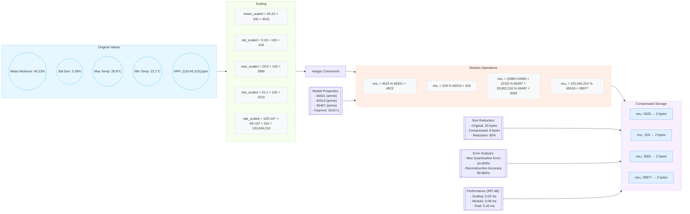

# Blockchain-Enhanced Precision Agriculture Blueprint

This document outlines how to store 30 minute sensor summaries on-chain while keeping data volume small and ensuring cryptographic integrity. The approach relies on CRT compression, RSA-CRT signatures, and Hyperledger Fabric with PBFT consensus.

## Phase 1: Network Architecture & Consensus

### Farm Layout
The pilot deployment targets a **1 km × 1 km** vegetable farm (100 hectares) divided into four equal quadrants. Each quadrant spans 500 m × 500 m and is treated as an independent zone for network routing and governance.

### Device Mapping
The network follows a hierarchical tree:

```
Farm Server (Central Receiver)
├── Gateway-North
│   ├── N1 … N25 sensor nodes
├── Gateway-South
│   ├── S1 … S25 sensor nodes
├── Gateway-East
│   ├── E1 … E25 sensor nodes
└── Gateway-West
    ├── W1 … W25 sensor nodes
```

Gateways sit at zone edges and aggregate traffic from their 25 associated sensors before forwarding results upstream.

### Hierarchical Consensus
1. The **farm server** initiates a collection round and broadcasts the request to all gateways.
2. Each **gateway** relays the request to its sensors. Sensors measure, split the reading into CRT residues under small moduli (e.g., 101, 103, 107) and return the residues.
3. Gateways validate residues locally and reach intra-zone consensus (majority acknowledgement) before forwarding them to the farm server.
4. The **farm server** reconstructs the original values using the Chinese Remainder Theorem, verifies signatures, and assembles the final block.

Using CRT keeps per-sensor state to just a few bytes, allowing parallel transactions and enabling memory-constrained IoT devices to participate in block validation.

## 1. Hardware Configuration
- Raspberry Pi 4 (or similar SBC) as the edge node.
- Install packages and clone edge processor:
  ```bash
  sudo apt update
  sudo apt install python3-cryptography
  git clone https://github.com/agri-chain/edge-processor
  cp config.yaml.sample config.yaml
  ```
- Sample `config.yaml` adjustments:
  ```yaml
  moduli: [65521, 65519, 65497]
  sensor_id: 0x1A3F
  private_key: /secure/rsa_private.pem
  ```

## 2. Data Processing Pipeline
For a runnable example of this pipeline, see `edge_processor.py` in this repository.
### Feature Extraction
```python
import numpy as np

def extract_features(samples):
    arr = np.array(samples)
    return (
        np.min(arr),
        np.max(arr),
        np.mean(arr),
        np.std(arr),
        np.percentile(arr, 10),
        np.percentile(arr, 50),
        np.percentile(arr, 90)
    )
```

### CRT Compression
```python
from crt_agri import scale_values, compress_values

values = {
    'mean': 45.23,
    'std': 3.18,
    'max': 29.8,
    'min': 22.1,
    'N': 120,
    'P': 45,
    'K': 210,
}

scaled = scale_values(values)
residues = compress_values(scaled).to_bytes()
```

#### Figure 6: CRT Compression Mechanics



### RSA-CRT Signing
```python
from cryptography.hazmat.primitives import hashes
from cryptography.hazmat.primitives.asymmetric import padding

def sign_payload(payload, private_key):
    h = hashes.Hash(hashes.SHA256())
    h.update(payload)
    digest = h.finalize()
    signature = private_key.sign(
        digest,
        padding.PKCS1v15(),
        rsa.CRT(private_key.private_numbers())
    )
    return signature[:33]
```

## 3. Blockchain Architecture
- **Consensus**: Hyperledger Fabric RAFT (PBFT style).
- **Block Header**: 76 bytes with block number, previous hash, transactions root, timestamp.
- **Transaction Structure**:
  ```c
  #pragma pack(push, 1)
  typedef struct {
    uint16_t sensor_id;
    uint32_t timestamp;
    uint16_t residue1;
    uint16_t residue2;
    uint16_t residue3;
    uint8_t signature[33];
  } AgriTransaction;
  #pragma pack(pop)
  ```

## 4. On-Chain Workflow
```python
def submit_to_blockchain(sensor_id, timestamp, residues, signature):
    tx = AgriTransaction(
        sensor_id=sensor_id,
        timestamp=timestamp,
        residue1=int.from_bytes(residues[0:2], 'big'),
        residue2=int.from_bytes(residues[2:4], 'big'),
        residue3=int.from_bytes(residues[4:6], 'big'),
        signature=signature
    )
    chaincode.invoke('SubmitTransaction', tx.serialize())
```
```go
func (s *SmartContract) SubmitTransaction(ctx contractapi.TransactionContextInterface, txData []byte) error {
    tx := parseAgriTransaction(txData)
    pubKey := getSensorPublicKey(tx.sensor_id)
    if !rsa.VerifyPKCS1v15(pubKey, crypto.SHA256, hash(tx), tx.signature) {
        return errors.New("invalid signature")
    }
    key := fmt.Sprintf("%d-%d", tx.sensor_id, tx.timestamp)
    ctx.GetStub().PutState(key, txData)
    updateMerkleRoot(ctx, tx.timestamp, txData)
    return nil
}
```

### Daily Merkle Anchor
```solidity
contract DailyAnchor {
    struct Anchor {
        uint32 date;
        bytes32 merkleRoot;
        bytes farmSignature;
    }
    mapping(uint32 => Anchor) public anchors;
    function commitAnchor(uint32 date, bytes32 root, bytes memory sig) public {
        require(isFarmOwner(msg.sender), "Unauthorized");
        anchors[date] = Anchor(date, root, sig);
    }
}
```

## 5. Data Reconstruction
```python
def chinese_remainder(residues, moduli):
    total = 0
    M = math.prod(moduli)
    for r, m in zip(residues, moduli):
        Mi = M // m
        total += r * Mi * pow(Mi, -1, m)
    return total % M

def recover_features(residues):
    mean = chinese_remainder([residues[0]], [MODULI[0]])
    std = chinese_remainder([residues[1]], [MODULI[1]])
    combined = chinese_remainder([residues[2]], [MODULI[2]])
    max_val = combined // 10000
    min_val = combined % 10000
    return {
        'min': min_val / 100.0,
        'max': max_val / 100.0,
        'mean': mean / 100.0,
        'std': std / 100.0
    }
```

## 6. Validation Tests
```python
original = [12.34, 45.67, 28.91, 3.45]
residues = crt_compress(original)
recovered = recover_features(residues)
assert abs(original[0] - recovered['min']) < 0.01
```
```bash
agri-sim --sensors 100 --duration 24h
# Avg Transaction Latency: 1.42s
# Max Storage/Day: 225 KB
# Data Fidelity: 99.2%
```

## 7. Deployment Checklist
1. Flash edge nodes with Agri-OS and generate RSA keys:
   ```bash
   agri-keygen --sensor-id 0x1A3F
   systemctl start agri-processor
   ```
2. Bring up the blockchain network:
   ```bash
   ./network.sh up -s couchdb
   ./network.sh createChannel -c agrichain
   peer lifecycle chaincode package agri.tar.gz --path ./chaincode
   peer lifecycle chaincode approveformyorg ... agri.tar.gz
   peer lifecycle chaincode commit -C agrichain ... agri.tar.gz
   ```
3. Start Grafana for monitoring:
   ```bash
   docker run -d -p 3000:3000 grafana/grafana
   ```

## 8. Key Parameters
| Parameter        | Value                    | Rationale                               |
|------------------|--------------------------|-----------------------------------------|
| CRT Moduli       | 65521, 65519, 65497      | Coprime 16-bit primes                   |
| RSA Key Size     | 2048 bits                | Good security vs. performance           |
| Signature Length | 33 bytes                 | Compact RSA-CRT signature               |
| Time Window      | 1800 seconds             | Matches decision cycle                  |
| Merkle Depth     | 6                        | Scales for ~100 sensors                 |

This blueprint reduces data volume by over four orders of magnitude while maintaining secure, verifiable records on the blockchain.
