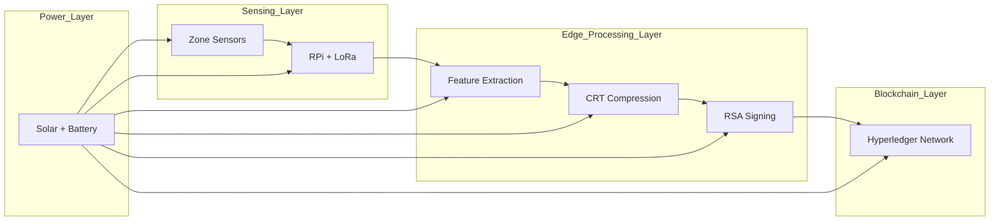

# Figure 1: Three-Tier System Architecture

```mermaid
flowchart LR
    subgraph Sensing_Layer
        sensors[Zone Sensors]
        lora[RPi + LoRa]
    end
    subgraph Edge_Processing_Layer
        features[Feature Extraction]
        crt[CRT Compression]
        rsa[RSA Signing]
    end
    subgraph Blockchain_Layer
        network[Hyperledger Network]
    end
    subgraph Power_Layer
        power[Solar + Battery]
    end

    sensors --> lora --> features --> crt --> rsa --> network
    power --> sensors
    power --> lora
    power --> features
    power --> crt
    power --> rsa
    power --> network
```
