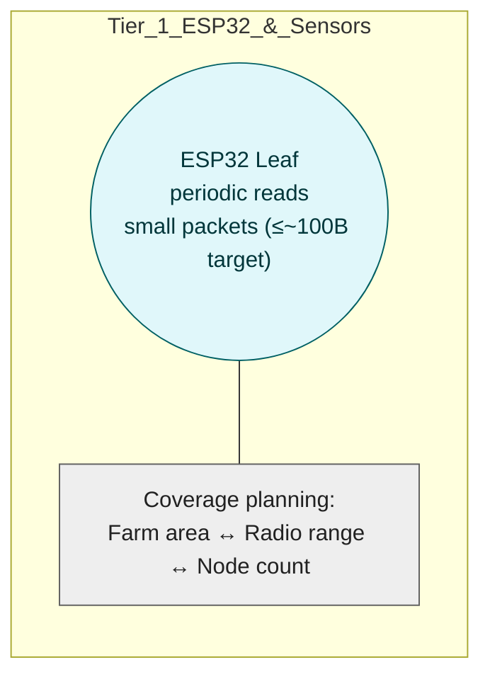

# Five-Tier System Architecture (Per-Tier Diagrams)

Each tier now has its own standalone Mermaid diagram for readability. Tier 1 and Tier 2 include Data Schemas with explicit sensor fields and CRT budget rules, while Tier 4 includes a Consensus & Block Policy justification section per reviewer feedback.

## Index

- [Tier 1 (ESP32 & Sensors)](#tier-1--esp32--sensors-standalone-diagram--data-schemas--crt-budget)
- [Tier 2 (Pi Ingress & Bundler)](#tier-2-pi-ingress--bundler)
- [Tier 3 (Mesh/Link)](#tier-3-meshlink)
- [Tier 4 (Hyperledger Fabric)](#tier-4-hyperledger-fabric)
- [Tier 5 (Observability & Ops)](#tier-5-observability--ops)

## Tier 1 — ESP32 & Sensors (Standalone Diagram + Data Schemas + CRT Budget)



### Data Schemas (Leaf → Pi payload)

```
device_id, seq, window_id, last_ts,
sensor_set = {temperature, soil_moisture, humidity, pH, light_lux, battery_v},
stats = {min, avg, max, std, count} per field,
flags {urgent},
optional crt {m[], r[]},
sig (Ed25519 or HMAC)
```

### CRT & Modular Arithmetic (When/Why) — Budget Establishment

Payload budget target ≤ ~100B. Example byte breakdown:

- ids/timestamps ≈ 16B
- sensor stats (6 fields × 5 stats × ~2B) ≈ 60B
- flags ≈ 1B
- signature ≈ 16B

Total approaches 93B; if the computed payload size exceeds the budget, enable CRT residues `r_i = x mod m_i` using pairwise co-prime `m[]` whose product spans the numeric range of the encoded values. The budget is established by summing the concrete field sizes of the sensor set above; when total > budget, CRT is triggered. Enabling CRT can influence secondary/relay node planning due to processing and memory trade-offs.

## Tier 2 (Pi Ingress & Bundler)

## Tier 3 (Mesh/Link)

## Tier 4 (Hyperledger Fabric)

## Tier 5 (Observability & Ops)

