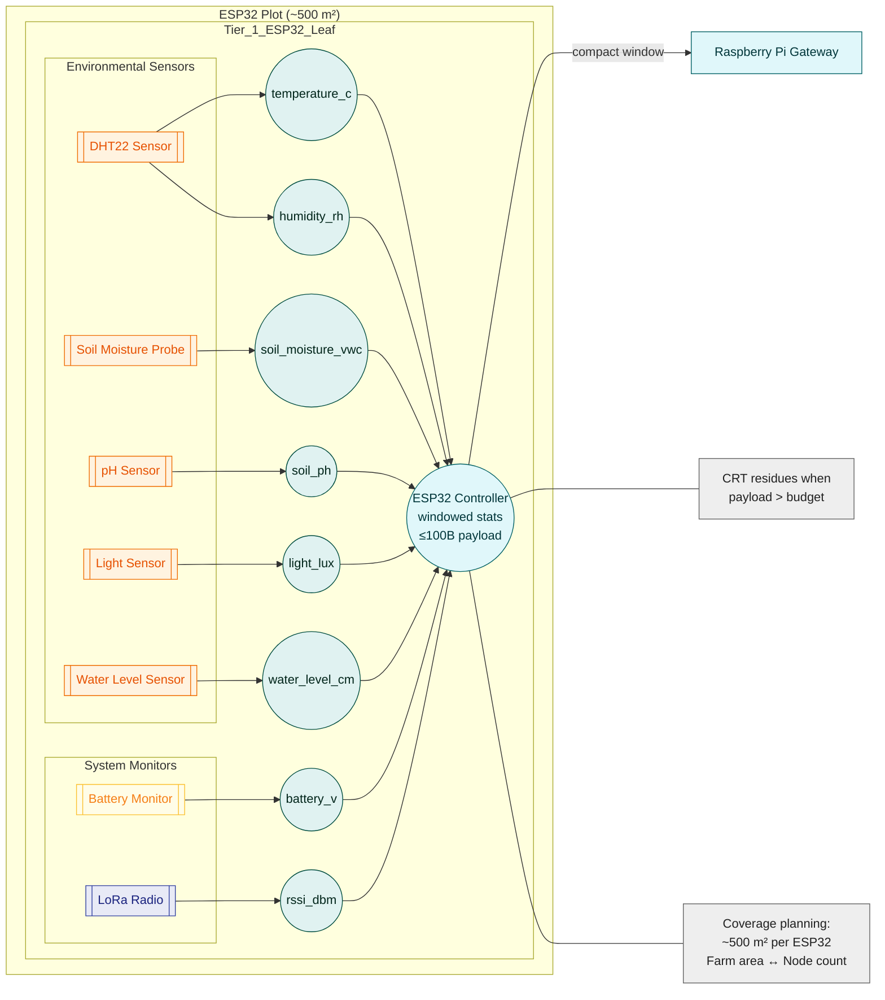
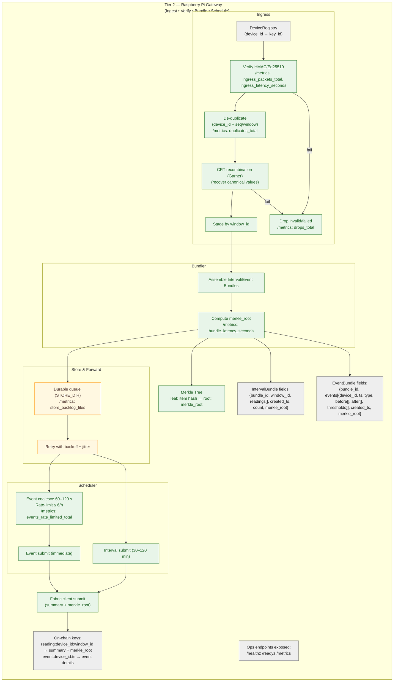
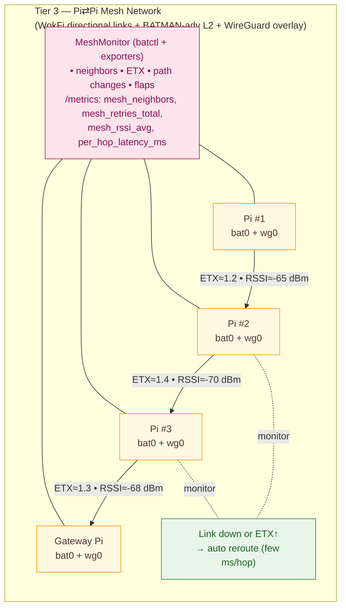
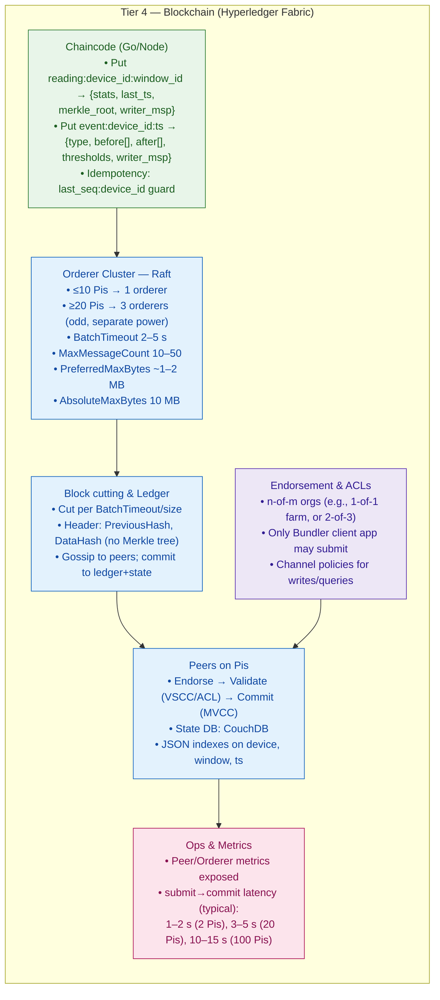
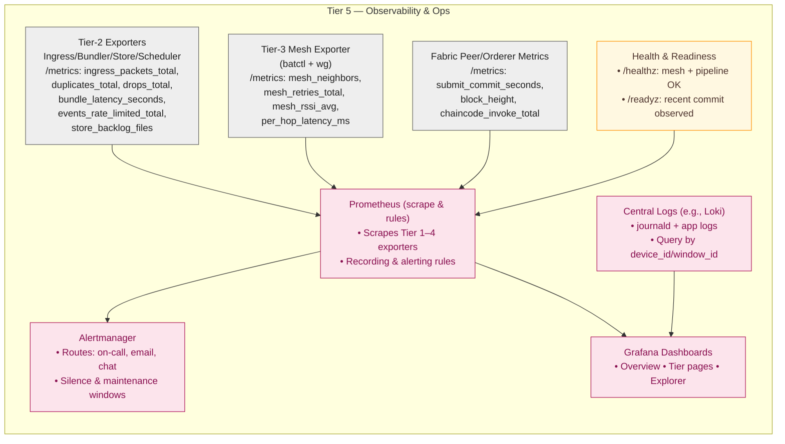

# Five-Tier System Architecture (Per-Tier Diagrams)

Each tier now has its own standalone Mermaid diagram for clarity. Tier 1 and Tier 2 include data schemas with explicit sensor fields and CRT budget rules, while Tier 4 describes consensus and block policy within Hyperledger Fabric.

## Index

- [All Tiers (End-to-End Overview)](#all-tiers-end-to-end-overview)
- [Tier 1 (ESP32 & Sensors)](#tier-1--esp32--sensors-standalone-diagram--data-schemas--crt-budget)
- [Tier 2 (Pi Ingress & Bundler)](#tier-2-pi-ingress--bundler)
- [Tier 3 (Mesh/Link)](#tier-3-meshlink)
- [Tier 4 (Hyperledger Fabric)](#tier-4-hyperledger-fabric)
- [Tier 5 (Observability & Ops)](#tier-5-observability--ops)
- [Node Scheme without CRT](#node-scheme-without-crt)
- [Node Scheme with CRT](#node-scheme-with-crt)

## All Tiers — End-to-End Overview

Here’s a clean, all-tiers, end-to-end Mermaid diagram that links the five tiers together.

```mermaid
flowchart LR
  %% ========== FIVE-TIER, END-TO-END ==========
  %% LAYOUT
  %% Left→Right: Tier 1 (ESP32) → Tier 2 (Pi GW) → Tier 3 (Mesh) → Tier 4 (Fabric) → Tier 5 (Obs)

  %% -------- TIER 1: ESP32 LEAVES --------
  subgraph T1["Tier 1 — ESP32 Leaves"]
    direction TB
    L1["ESP32\n• sensor_set: temperature, soil_moisture, humidity, soil_ph, light_lux, battery_v, rssi_dbm\n• data: temp 25.7°C, moisture 24%, humidity 61%, pH 6.3, lux 2400, battery 3.81V, rssi -78dBm\n• window stats: {min,avg,max,std,count}\n• flags: urgent\n• optional CRT: m[], r[]\n• sig: Ed25519/HMAC"]:::t1
  end

  %% -------- TIER 2: PI GATEWAY (INGRESS → BUNDLER) --------
  subgraph T2["Tier 2 — Pi Gateway"]
    direction TB
    IN["Ingress\nverify sig → dedupe → stage by window_id"]:::t2
    BN["Bundler\nassemble IntervalBundle/EventBundle\ncompute merkle_root"]:::t2
    SF["Store & Forward\nDurable queue + retry"]:::t2
    SCH["Scheduler\nPeriodic 30–120 min\nEvents immediate"]:::t2
    IN --> BN --> SF --> SCH
  end

  %% -------- TIER 3: PI⇄PI MESH --------
  subgraph T3["Tier 3 — Pi⇄Pi Mesh\nBATMAN-adv (L2) + WireGuard overlay"]
    direction TB
    P1["Pi #1 bat0+wg0"]:::t3 -->|"few ms/hop"| P2["Pi #2 bat0+wg0"]:::t3 -->|"few ms/hop"| GW["Gateway Pi"]:::t3
  end

  %% -------- TIER 4: HYPERLEDGER FABRIC --------
  subgraph T4["Tier 4 — Blockchain (Hyperledger Fabric)"]
    direction TB
    ORD["Orderer(s) — Raft\nBatchTimeout 2–5 s\n≤10 Pis→1 orderer; ≥20 Pis→3 orderers"]:::t4
    PEER["Peers\nendorse → validate → commit\nStateDB: CouchDB + JSON indexes"]:::t4
    CC["Chaincode keys\nreading:device_id:window_id → {summary + merkle_root}\nevent:device_id:ts → {details + writer_msp}\nIdempotency: last_seq:device_id"]:::t4
    LEDGER["Ledger + State\nblocks (header: PrevHash, DataHash)\nstate holds summaries + merkle_root"]:::t4
    ORD --> PEER --> LEDGER
    CC -. writes .- PEER
  end

  %% -------- TIER 5: OBSERVABILITY --------
  subgraph T5["Tier 5 — Observability & Ops"]
    direction TB
    HZ["Health & Readiness\n/healthz · /readyz"]:::t5
    PR["Prometheus\n/metrics scrape + rules"]:::t5
    GF["Grafana Dashboards\nOverview • Tier pages • Explorer"]:::t5
    AM["Alertmanager\nOn-call routes · silences"]:::t5
    PR --> AM
    PR --> GF
    HZ --> PR
  end

  %% -------- DATA FLOW (LEFT→RIGHT) --------
  L1 -->|"Wi-Fi client (WPA2/3)\nwindow summary + urgent"| IN
  SCH -->|"Client submit\n(summary + merkle_root)"| P1
  GW -->|"gRPC/TLS over wg0"| ORD

  %% -------- OBSERVABILITY FEEDS --------
  IN -. "/metrics:\ningress_packets_total\nduplicates_total\ndrops_total\ningress_latency_seconds" .-> PR
  BN -. "/metrics:\nbundle_latency_seconds\nevents_rate_limited_total" .-> PR
  SF -. "/metrics:\nstore_backlog_files" .-> PR
  T3 -. "/metrics:\nmesh_neighbors\nmesh_retries_total\nmesh_rssi_avg\nper_hop_latency_ms" .-> PR
  PEER -. "/metrics:\nsubmit_commit_seconds\nblock_height\nchaincode_invoke_total" .-> PR
  PEER -. "commit events\n(readiness)" .-> HZ

  %% -------- STYLES --------
  classDef t1 fill:#e0f7fa,stroke:#006064,color:#00363a;
  classDef t2 fill:#fff8e1,stroke:#ff8f00,color:#4e342e;
  classDef t3 fill:#ede7f6,stroke:#5e35b1,color:#311b92;
  classDef t4 fill:#e3f2fd,stroke:#1565c0,color:#0d47a1;
  classDef t5 fill:#fce4ec,stroke:#ad1457,color:#880e4f;
```



### End-to-End Performance Levers & Trade-offs

Latency budget (rule-of-thumb). Let \(H\) be mesh hops, \(t_h\) per-hop latency (ms), \(T_q\) Tier‑2 queueing/bundle time (histogram `bundle_latency_seconds`), \(T_b\) orderer BatchTimeout (s), and \(T_v\) peer validation/commit time. Then:

\[
T_{e2e} \approx T_q + H \cdot t_h + T_b + T_v
\]

Tune levers to keep \(T_{e2e}\) within SLO (see next section).

What each lever changes:

| Lever | You tune | Affects | Measure with | Where |
| --- | --- | --- | --- | --- |
| Cadence | 30–120 min windows | Storage vs freshness | `bundles_submitted_total{type}`, ledger growth/day | Tier 2→4 |
| Event coalesce / rate-limit | 60–120 s, ≤6/h | Burst control, backlog | `events_rate_limited_total`, `store_backlog_files` | Tier 2 |
| BatchTimeout | 2–5 s | Event commit delay, block size | `submit_commit_seconds` p95, block cuts/min | Tier 4 |
| Orderers | 1 vs 3 | Fault tolerance, commit tails | `submit_commit_seconds` p99 under failure drills | Tier 4 |
| Mesh hops | Node spacing, links | \(H \cdot t_h\) term, PDR | `per_hop_latency_ms`, `mesh_neighbors` | Tier 3 |
| Bundle size | Window length, filters | Queue time \(T_q\), ledger/day | `bundle_latency_seconds`, on-chain bytes/day | Tier 2/4 |
| CRT on leaf | Budget threshold + moduli set | Packet size, relay count/memory | payload bytes calc, success of Garner recombination | Tier 1/2 |


### SLOs, Alerts & Readiness Contracts

Service Level Objectives (targets to defend with data):

- **Submit→commit (p95):** ≤ 5 s at steady state; show distributions for 2, 20, 100 Pis.
- **Periodic bundles:** commit within window + 1×BatchTimeout (e.g., 60 min + 5 s).
- **Event bundles:** commit within ≤ 2×BatchTimeout (e.g., ≤10 s).
- **Mesh health:** per-hop latency p95 < 8 ms, min neighbors ≥ 2 per node.
- **Backlog:** `store_backlog_files` not increasing over 30 min windows.
- **Duplicates:** `duplicates_total` rate < 1% of `ingress_packets_total`.

Prometheus recording rules:

```yaml
- record: fabric:submit_commit_seconds:p95
  expr: histogram_quantile(0.95, sum by (le) (rate(submit_commit_seconds_bucket[5m])))
- record: t2:bundle_latency_seconds:p95
  expr: histogram_quantile(0.95, sum by (le) (rate(bundle_latency_seconds_bucket[5m])))
- record: pipeline:duplicates_ratio
  expr: rate(duplicates_total[5m]) / rate(ingress_packets_total[5m])
- record: mesh:min_neighbors
  expr: min(mesh_neighbors)
- record: t2:backlog_trend_30m
  expr: increase(store_backlog_files[30m])
```

Alert rules (examples):

- alert: FabricSlowCommits
  expr: fabric:submit_commit_seconds:p95 > 5
  for: 10m
  labels: {severity: page}
  annotations: {summary: "p95 submit→commit > 5s"}

- alert: PeriodicMissedWindow
  expr: (time() - max_over_time(last_periodic_commit_ts[2h])) > (60*60 + 5)
  for: 5m
  labels: {severity: page}
  annotations: {summary: "Periodic bundle missed window+timeout"}

- alert: MeshDegraded
  expr: mesh:min_neighbors < 2 or avg_over_time(per_hop_latency_ms[5m]) > 8
  for: 15m
  labels: {severity: warn}
  annotations: {summary: "Mesh neighbors/latency out of SLO"}

- alert: BacklogGrowing
  expr: t2:backlog_trend_30m > 50
  for: 30m
  labels: {severity: warn}
  annotations: {summary: "Store&Forward backlog growing"}

Readiness contracts (wire `/readyz` to real liveness):

  - Indicate READY only if a new commit height was observed within the last 2×BatchTimeout or the last scheduled periodic window (whichever is tighter).
- Fail readiness if mesh route to the orderer is down (no neighbors or no WireGuard session), or if backlog exceeds a threshold for > 30 min.
- Keep `/healthz` simple (pipeline alive, no fatal loops), but `/readyz` should depend on recent ledger progress to prevent false-ready states.


### How to read this (brief explanations)

1. **Tier 1 → Tier 2:** Each ESP32 sends a window summary with an `urgent` flag and optional CRT residues. Tier 2 verifies, de-duplicates, stages, bundles, and computes a `merkle_root`.
2. **Tier 2 → Tier 3 → Tier 4:** The Scheduler submits periodic bundles (30–120 min) and event bundles immediately, traversing the mesh to the Fabric orderer and peers for validation and commit. Chaincode stores summaries and `merkle_root` values.
3. **Tier 5 (Observability):** Every tier exposes `/metrics` scraped by Prometheus; Grafana visualizes, and Alertmanager routes alerts. Readiness depends on recent commit activity.
4. **Performance levers shown inline:** BatchTimeout, orderer count, bundle cadence, mesh hop count, and Tier‑2 latency/backlog highlight throughput and latency levers.

## Tier 1 — ESP32 & Sensors (Standalone Diagram + Data Schemas + CRT Budget)

Purpose & cadence. Tier 1 reads local sensors at a fixed interval (e.g., every few minutes), builds a compact windowed summary, and sends it to the nearest Raspberry Pi gateway. The leaf favors small packets with statistics and optional event flags to keep radio use and power low.

Coverage planning. The number of leaf nodes depends on farm surface area and radio range; using CRT can increase the need for secondary/relay nodes (processing/memory trade-offs).

Mathematically, each sensor \(s\) produces a time series of readings \(x_s(t)\). Over a sampling window \(W\) with \(|W|\) samples, the node derives
\[
\text{avg}_s = \frac{1}{|W|} \sum_{t\in W} x_s(t),\qquad
\text{min}_s = \min_{t\in W} x_s(t),\qquad
\text{max}_s = \max_{t\in W} x_s(t),
\]
\[
\text{std}_s = \sqrt{\frac{1}{|W|}\sum_{t\in W} (x_s(t)-\text{avg}_s)^2},\qquad
\text{count}_s = |W|.
\]
The statistics for sensor \(s\) form the tuple \(S_s=(\text{min}_s,\text{avg}_s,\text{max}_s,\text{std}_s,\text{count}_s)\), which is encoded in the outgoing payload.





### Leaf → Pi Payload (with actual sensor data)

Envelope (IDs & timing)

- device_id (string/bytes): unique leaf identifier  
- seq (uint32): monotonic packet sequence  
- window_id (uint32): sliding/rolling window identifier  
- last_ts (uint64): last sample timestamp (epoch ms)

Sensor set (environmental & system vitals) — include all that apply

- temperature_c (°C)  
- soil_moisture_vwc (% volumetric water content)  
- humidity_rh (% relative humidity)  
- soil_ph (pH, unitless)  
- light_lux (lux)
- battery_v (V battery voltage)
- rssi_dbm (dBm, link quality during last uplink)
- water_level_cm (cm water level)

For each sensor in sensor_set, embed windowed statistics in stats:  
{min, avg, max, std, count} (numeric, fixed-point or scaled int). This preserves trends but keeps packets small.

Event & control flags

- urgent (bool/bitfield): fast-path submit for threshold breaches (e.g., temp high, moisture low).

Optional CRT residues (size relief)

- crt: { m[], r[] }: residues r_i = x mod m_i for selected large numeric fields when the payload risks exceeding the byte budget; moduli m[] are pairwise coprime and their product covers the numeric range; the Pi recombines via Garner’s algorithm.

Integrity

- sig (Ed25519 or HMAC) over the envelope + stats (protects integrity/identity using the device registry).

#### Example JSON (illustrative)

```json
{
  "device_id": "leaf-13",
  "seq": 4821,
  "window_id": 109,
  "last_ts": 1693212345678,
  "sensor_set": ["temperature_c","soil_moisture_vwc","humidity_rh","soil_ph","light_lux","water_level_cm","battery_v","rssi_dbm"],
  "stats": {
    "temperature_c": {"min": 24.1, "avg": 25.7, "max": 27.8, "std": 0.6, "count": 36},
    "soil_moisture_vwc": {"min": 23.0, "avg": 24.4, "max": 26.9, "std": 0.8, "count": 36},
    "humidity_rh": {"min": 58.2, "avg": 61.0, "max": 63.4, "std": 1.1, "count": 36},
    "soil_ph": {"min": 6.2, "avg": 6.3, "max": 6.4, "std": 0.05, "count": 36},
    "light_lux": {"min": 1200, "avg": 2400, "max": 4000, "std": 500, "count": 36},
    "water_level_cm": {"min": 42, "avg": 48, "max": 55, "std": 3.2, "count": 36},
    "battery_v": {"min": 3.78, "avg": 3.81, "max": 3.84, "std": 0.02, "count": 36},
    "rssi_dbm": {"min": -86, "avg": -78, "max": -72, "std": 3.1, "count": 6}
  },
  "urgent": false,
  "sig": "<64B>"
}
```

### Byte-Budget & CRT (When/Why)

Define a target payload budget (e.g., ≤ ~100 B) and compute it from the actual fields above (IDs/timestamps + N sensors × 5 stats + signature + flags). If the computed size for a given window exceeds the budget, enable `crt{m[], r[]}` for selected large numeric groups (e.g., multi-field stats), choosing moduli so that the product covers their range; Pi recombines to canonical values before bundling and Merkle hashing. This answers “How is the budget established to enable CRT?” → by summing concrete field sizes and switching CRT only when the sum exceeds the set budget. The choice can influence secondary/relay node planning due to processing/memory trade-offs.

A representative calculation is below (assuming 7 sensors and 16-bit stats):

| Component                                 | Bytes |
|-------------------------------------------|------:|
| device_id + seq + window_id + last_ts     |   20 |
| flags                                     |    1 |
| stats (7 sensors × 5 stats × 2 B)         |   70 |
| signature (HMAC-SHA256)                   |   32 |
| **Total**                                 | **123** |

Because the total exceeds the 100 B target, the node activates CRT for the bulkiest integers. Each such value \(x\) is encoded as residues \(r_i = x \bmod m_i\) under pairwise-coprime moduli \(m_i\). Sending two 1-byte residues instead of a 32-bit integer shrinks the payload while preserving deterministic reconstruction on the Pi.

CRT is **optional**: if the calculated size remains under the budget, the node omits the `crt` field and transmits canonical integers directly. When the window threatens to overflow the limit (e.g., many sensors or high‑precision counts), the node selects pairwise coprime moduli \(m_i\) (e.g., \(97,101,103\)) whose product covers the numeric range and sends residues \(r_i = x \bmod m_i\). The Pi reconstructs \(x\) using the Chinese Remainder Theorem—typically via Garner’s algorithm—verifies that \(x < \prod m_i\), and restores the original integer before computing the Merkle hash. Thus CRT reduces wire size without changing the deterministic value hashed into the tree or seeding the blockchain.

### Hand-off to Tier 2

The leaf transmits the compact window summary (and any urgent events) to the nearest Pi gateway, which verifies/deduplicates and stages by `window_id` for bundling and Merkle-root computation downstream.

For each payload \(P_i\) the gateway computes a cryptographic hash
\[ h_i = H(P_i) \]
using a function such as SHA-256, yielding the Merkle tree leaves. Hashes are paired and folded iteratively,
\[ h_{i,j} = H(h_{2i} \Vert h_{2i+1}) \]
until a single root \(R\) remains. The inaugural root \(R_0\) seeds the ledger by forming the first block \(B_0=(R_0, t_0)\), and each subsequent window contributes a new root \(R_k\) appended as block \(B_k\). This process both compacts Tier 1 data and begins the blockchain.

## Tier 2 (Pi Ingress & Bundler)

Role. Tier 2 is the gateway that receives leaf packets, verifies and de-duplicates them, stages per time window, and assembles bundles for downstream commit. It submits bundles on a schedule and immediately for events.

---

1) **Ingress (verify → dedupe → stage)**
- **Packet verification & identity.** Validate message structure and the device identity; verify HMAC/Ed25519 signatures using the device registry that maps `device_id → key_id`.
- **De-duplication.** Drop repeats (e.g., using `device_id + seq/window_id` as an idempotency key) and keep a counter for duplicates; only clean, unique records proceed to staging.
- **Window staging.** Organize valid readings by `window_id` into queues on disk so that the Bundler can efficiently build a periodic `IntervalBundle` for that window.

*Ops/metrics exposure.* Gateways expose `/healthz`, `/readyz`, and `/metrics` so Tier 5 can scrape packet counts/latency/system load from Tier 2.

---

2) **Bundler (build → hash → forward)**

Tier 2 produces two bundle types (define them concretely in the doc so they're unambiguous):

- **IntervalBundle** — periodic summaries for a time window  
  `bundle_id`, `window_id`, `readings[]`, `created_ts`, `count`, `merkle_root`
- **EventBundle** — immediate submits for thresholded/urgent events  
  `bundle_id`, `events[{device_id, ts, type, before[], after[], thresholds}]`, `created_ts`, `merkle_root`

*Merkle root (bundle proof).* For each bundle, hash each item (reading/event), build the tree, and record the Merkle root inside the bundle. Tier 4 (Fabric) stores summary + `merkle_root`; later, any raw item can be proven with a Merkle path instead of storing all raw data on-chain.

*Cadence & triggers.* The scheduler submits periodic bundles every 30–120 min, and event bundles immediately; this choice directly impacts end-to-end latency vs. storage trade-offs that should be justified with measurements/plots.

*Failure handling (CRT edge cases).* When upstream uses CRT at Tier 1, recombine residues at the Pi via Garner’s algorithm; if some item can't be reconstructed, mark that record invalid (log reason) but continue others, and prefer canonical (recovered) values for Merkle hashing so proofs align with on-chain roots.

---

3) **On-chain mapping (how Tier 2 output is stored/indexed)**

- **Key patterns.**
  - `reading:device_id:window_id` → summary stats (+ proof hash/`merkle_root`)
  - `event:device_id:ts` → event details  
    Rationale: store summaries to keep the ledger compact; rely on Merkle proofs to recover/verify raw items when needed.
- **Handoff to Tier 4.** Bundler acts as the client that submits transactions to Fabric; ordering/commit latency and block timing are governed in Consensus & Block Policy (Tier 4), which should be defined and justified (`BatchTimeout`, orderer count, latency bands).

---

4) **Tier-2 gateway diagram**



## Tier 3 (Mesh/Link)



- Topology & radio planning. Use directional links (“WokFi” or equivalent) to increase SNR and extend range between Pis; plan node spacing so the expected hop count keeps end-to-end delay within your cadence target. The mesh should tolerate single-link failures without violating latency SLOs.
- Protocol stack. Radios run WPA2/3; BATMAN-adv provides Layer-2 meshing and path selection via ETX; WireGuard encrypts payloads end-to-end across bat0.
  - Performance targets. Record measured per-hop latency (aim “few ms per hop”), packet delivery ratio, route-flap rate, and jitter under varying traffic. These metrics inform QoS trade-offs for Hyperledger Fabric deployments.
- Metrics to export. mesh_neighbors, mesh_retries_total, mesh_rssi_avg, per_hop_latency_ms, and path_change_total (or equivalent) for Grafana.
- Failure modes. Show how the mesh re-routes when a link’s ETX rises or RSSI falls; log an alert if ETX stays above a threshold for N windows to force maintenance.

## Tier 4 (Hyperledger Fabric)



### Blockchain & Ledger Overview

Hyperledger Fabric peers keep two synchronized data structures: an immutable
blockchain and a mutable world state.  Each block contains a header with the
`PreviousHash` and `DataHash`, an ordered list of transactions and associated
metadata.  Linking the `PreviousHash` values forms a tamper‑evident chain.  When
a block commits, the peer appends it to the block store and applies each
transaction’s write‑set to the state database (CouchDB in this deployment),
allowing fast queries of current values while preserving the full audit trail.

Transactions progress through four phases:

1. **Endorsement:** the client invokes chaincode on endorsing peers and
   collects signatures over the produced read/write sets.
2. **Ordering:** endorsed transactions are sent to the ordering service for
   global sequencing.
3. **Validation:** peers verify endorsement policies and check for MVCC
   conflicts.
4. **Commit:** validated transactions are written to the block chain and world
   state atomically.

### Consensus & Block Policy

- **Consensus:** Raft crash‑fault tolerant protocol. Orderers elect a leader
  that appends transactions to a replicated log; followers persist entries and
  the block is final once a quorum (⌈n/2⌉) stores it, eliminating forks. **Sizing
  rule:** ≤10 Pis → **1 orderer**; ≥20 Pis → **3 orderers** (odd number, separate
  power domains) so the cluster survives one failure while keeping quorum.
- **Formation:** Scheduler submits **periodic bundles every 30–120 min**; **event bundles immediately**. Orderer cuts blocks by **BatchTimeout/size** (not instant). Keep **BatchTimeout small (2–5 s)** so events commit quickly while periodic cadence is dominated by windowing.
- **Batching knobs:** Start with **MaxMessageCount 10–50**, **PreferredMaxBytes ~1–2 MB**, **AbsoluteMaxBytes 10 MB** (tune per throughput/link quality). Present measurement plots to justify.
- **Latency targets:** **submit→commit** ≈ **1–2 s (2 Pis), 3–5 s (20 Pis), 10–15 s (100 Pis)**; validate with runs.
- **Timing parameters:**
  - **BatchTimeout:** 2–5 s upper bound before block cut; small values keep event latency low.
  - **TickInterval:** 500 ms base Raft clock.
  - **ElectionTick:** 10 ticks (≈5 s) for leader election; balances quick failover against false positives on a lossy mesh.
  - **HeartbeatTick:** 1 tick (500 ms) heartbeat from leader; detects failures within a second.
  - **SnapshotInterval:** 10 000 blocks (~7 days at 1‑min windows); limits state transfer time during recovery.
  - **BlockRetention:** retain last 100 blocks on orderers for fast restarts.

Carefully tuning these timers is critical: too aggressive values cause flapping in a rural mesh, while sluggish ones inflate commit latency. The selected values assume sub‑second inter‑Pi RTTs and periodic bundles every 30–120 minutes; adjust if network conditions differ.

### Block Formation & Size Estimates

1. **Leaf payload.** Each ESP32 summarizes \(S\) sensors with five statistics (min, avg, max, std, count). Assuming 32‑bit floats:
   \[
   \text{sensor_bytes} = 5 \times 4 = 20\text{ B},\qquad
   \text{leaf_bytes} = S \times 20 + 40
   \]
   The extra 40 B covers device/window IDs, flags and a signature. For the seven environmental sensors in Tier 1, \(\text{leaf_bytes}≈200\) B.
2. **Bundle payload.** A Pi gateway aggregates \(L\) leaf payloads and appends a 32 B Merkle root plus ~32 B of headers:
   \[
   \text{bundle_bytes} = L \times \text{leaf_bytes} + 64
   \]
3. **Block construction.** The scheduler submits one bundle per Pi every window interval \(W\) minutes. The orderer collects the \(N_{\text{pi}}\) bundles and cuts a block after `BatchTimeout` or size triggers:
   \[
   \text{block_bytes} = 200 + N_{\text{pi}} \times \text{bundle_bytes}
   \]
   A ~200 B overhead accounts for the block header and metadata.
4. **Ledger growth.** Blocks arrive once per window, so the yearly ledger size is
   \[
   \text{ledger}_{\text{year}} = \text{block_bytes} \times \frac{365\times1440}{W}
   \]

**Example.** With \(S=8\) sensors per leaf, \(L=10\) leaves per Pi, \(N_{\text{pi}}=50\) gateways and \(W=60\) min:

- \(\text{bundle_bytes} = 10 \times (8\times20 + 40) + 64 = 2{,}064\) B.
- \(\text{block_bytes} = 200 + 50 \times 2{,}064 \approx 103{,}400\) B (≈101 KB).
- \(\text{ledger}_{\text{year}} \approx 103{,}400 \times \frac{365\times1440}{60} \approx 9.1\times10^8\) B (≈0.9 GB).

These formulas let you plug in different numbers of Pis or sensors to estimate block and ledger sizes.

### Chaincode & On-Chain Keys

- `reading:device_id:window_id` → `{stats, last_ts, merkle_root, writer_msp}`
- `event:device_id:ts` → `{type, before[], after[], thresholds, writer_msp}`
- Store summaries plus **merkle_root** to keep ledger small; recover raw via Merkle proofs.
- Idempotency via `last_seq:device_id` check to safely handle retries.

### State DB & Query Performance

- Use **CouchDB** for state. Create JSON indexes for common queries:
  ```json
  {"index":{"fields":["device_id","window_id"]},"name":"idx_device_window","type":"json"}
  ```
  ```json
  {"index":{"fields":["device_id","ts"]},"name":"idx_device_ts","type":"json"}
  ```
  These support fast lookups like “show window X for device Y” and “events for device Y since T”.

### Security & Access

- **MSP & ACLs:** only the **Bundler client** identity can invoke `PutReading/PutEvent`. Readers get read-only. Rotate certs and enable TLS everywhere.

### Observability

  - Export peer/orderer metrics and graph **submit→commit** and **block-cut** distributions under different cadences to tune Hyperledger Fabric performance.

## Tier 5 (Observability & Ops)


### Endpoints and what they mean

* **`/healthz`**: returns **OK only when** the Pi pipeline is processing (ingress→bundler→scheduler) **and** mesh links are up enough to reach the gateway—keeps probes honest.
* **`/readyz`**: returns **OK when a recent Fabric commit** (submit→commit) has been observed within a bounded time window; this couples readiness to ledger liveness.

### Canonical metric names (stick to Prometheus conventions)

* **Counters** (suffix `_total`): `ingress_packets_total`, `duplicates_total`, `drops_total`, `bundles_submitted_total{type}`, `events_rate_limited_total`.
* **Histograms** (suffix `_seconds`): `ingress_latency_seconds`, `bundle_latency_seconds`, `submit_commit_seconds`.
* **Gauges**: `mesh_neighbors`, `mesh_rssi_avg`, `store_backlog_files`, `block_height`.
   This exposes health and metrics from gateways and services while tracking packet counts and latency.

### PromQL you can paste (recording rules)

```yaml
# 1) Duplicates rate (per minute)
- record: pipeline:duplicates_per_min
  expr: rate(duplicates_total[5m]) * 60

# 2) Submit→commit p95 (Fabric end-to-end)
- record: fabric:submit_commit_seconds:p95
  expr: histogram_quantile(0.95, sum by (le) (rate(submit_commit_seconds_bucket[5m])))

# 3) Bundle latency p95 (Tier-2)
- record: t2:bundle_latency_seconds:p95
  expr: histogram_quantile(0.95, sum by (le) (rate(bundle_latency_seconds_bucket[5m])))

# 4) Mesh neighbor floor (minimum over Pis)
- record: mesh:min_neighbors
  expr: min(mesh_neighbors)

# 5) Backlog size (files waiting to send)
- record: t2:store_backlog_files
  expr: max(store_backlog_files)
```

### Alert rules (examples)

```yaml
groups:
- name: orion-tier5-alerts
  rules:
  - alert: FabricSlowCommits
    expr: fabric:submit_commit_seconds:p95 > 5
    for: 10m
    labels: {severity: page}
    annotations:
      summary: "Fabric p95 submit→commit > 5s"
      runbook_url: "runbooks/fabric_slow_commits.md"

  - alert: EventStorm
    expr: rate(bundles_submitted_total{type="event"}[5m]) > 0.2  # >12/h
    for: 10m
    labels: {severity: warn}
    annotations:
      summary: "High event submit rate (possible storm)"

  - alert: MeshDegraded
    expr: mesh:min_neighbors < 2 or avg_over_time(per_hop_latency_ms[5m]) > 8
    for: 15m
    labels: {severity: warn}
    annotations:
      summary: "Mesh health degraded (neighbors/latency)"

  - alert: BacklogGrowing
    expr: increase(store_backlog_files[30m]) > 50
    for: 30m
    labels: {severity: warn}
    annotations:
      summary: "Store&Forward backlog growing"
```

### Dashboard structure (fast to navigate)

1. **Overview** (single pane): key health (`/healthz`, `/readyz`), **p95 submit→commit**, bundle throughput, event rate, backlog gauge, mesh neighbors min.
2. **Tier-2 page**: ingress packet trend, duplicates/drop rates, **bundle latency** histogram, backlog, scheduler cadence.
3. **Tier-3 page**: neighbors by node, **per-hop latency**, retries, RSSI; highlight path changes/flaps.
4. **Tier-4 page**: **submit→commit percentiles**, block cuts per minute, peer/orderer health, chaincode invokes, state DB ops.
5. **Explorer**: device/window drilldown; filter by `device_id`, `window_id`, or event type.
   These steps reflect Tier 5's intent: health checks and dashboards that show system status and recent activity.

### SLOs to pin down

* **Submit→commit (p95)**: ≤ 5 s under normal load; show distributions at your scales (2, 20, 100 Pis).
* **Bundle schedule adherence**: periodic 30–120 min windows commit within **window + 1×BatchTimeout**; events commit in **< 2×BatchTimeout**; defend these with plots.
* **Mesh health**: ≥ 2 neighbors/node; **per-hop latency** < 8 ms on p95.

### Ops notes (so it keeps running)

* **Labels & cardinality**: keep `device_id` as a **label only on low-cardinality series** (e.g., *last seen* gauges); prefer window/device as **log fields** (Loki) or query keys in Fabric, not high-cardinality Prom metrics.
* **Histogram buckets**: for `submit_commit_seconds`/`bundle_latency_seconds`, pick buckets like `[0.5, 1, 2, 3, 5, 8, 13]`.
* **Runbooks**: link each alert to a one-page fix guide (mesh degraded, backlog growing, Fabric slow, event storm).
* **Readiness**: wire `/readyz` to **observed block height advancing** to avoid false-ready states.

## Data Schemas and Leaf Sensor Data

This section summarises the canonical data schemas used from the sensors up through observability and describes the raw measurements collected across the leaf field.

### Tier 1 — Sensor Window Schema
Each ESP32 leaf records a vector of readings
x(t) = { T(t), M(t), H(t), pH(t), L(t), V(t), R(t) }
  for temperature T, soil moisture M, relative humidity H, soil pH, light intensity L, battery voltage V and RSSI R. Over a sampling window W the node outputs:

avg_s = (1/|W|) Σ_{t∈W} x_s(t)
min_s = min_{t∈W} x_s(t)
max_s = max_{t∈W} x_s(t)
std_s = √[(1/|W|) Σ_{t∈W} (x_s(t) − avg_s)^2]
count_s = |W|

along with timestamp τ_W, signature and optional CRT residue pairs (m_i, r_i).

#### Field semantics and units

| Symbol | Measurement        | Units  | Notes                              |
|-------|--------------------|--------|------------------------------------|
| T     | Temperature        | °C     |  -40…85 typical for ESP32 sensor   |
| M     | Soil moisture      | %      | 0–100 volumetric water content     |
| H     | Relative humidity  | %      | 0–100 ambient air humidity         |
| pH    | Soil acidity       | pH     | 3–10 range across crops            |
| L     | Light intensity    | lux    | 0–65535 from photometric sensor    |
| V     | Battery voltage    | V      | 0–6 range depending on cell type   |
| R     | RSSI               | dBm    | -120…0 link budget                 |

Each window is emitted as JSON:

```json
{
  "device_id": "leaf-42",
  "window_id": 123,
  "timestamp": "2024-05-11T10:00:00Z",
  "stats": {
    "T": {"avg": 21.7, "min": 18.3, "max": 24.1, "std": 1.2, "count": 120},
    "M": {"avg": 43.1, "min": 41.9, "max": 45.0, "std": 0.6, "count": 120}
  },
  "signature": "<ecdsa>"
}
```

This canonical schema fixes field names, units and numeric ranges so downstream tiers can validate data without out-of-band agreements.

#### Byte layout and CRT activation

| Field                                   | Bytes | Notes                                   |
|-----------------------------------------|------:|-----------------------------------------|
| device_id + window_id + seq + last_ts   |   20 | identifiers and timing                   |
| flags                                   |    1 | bitfield for QoS / alerting             |
| stats (7 sensors × 5 stats × 2 B)       |   70 | 16‑bit min/avg/max/std/count per sensor |
| signature (HMAC‑SHA256)                 |   32 | message authentication                   |
| **Total (no CRT)**                      | **123** | exceeds 100 B target budget            |

When the summed size crosses the 100 B budget, the node appends a `crt` object encoding large integers as residues:

```json
{
  "device_id": "leaf-42",
  "window_id": 123,
  "timestamp": "2024-05-11T10:00:00Z",
  "stats": { /* ... */ },
  "crt": { "m": [97,101,103], "r": [43,52,60] },
  "signature": "<ecdsa>"
}
```

Each modulus/residue pair adds two bytes; choosing pairwise‑coprime moduli whose product spans the original value lets the Pi reconstruct canonical integers via the Chinese Remainder Theorem before bundling and Merkle hashing.

### Tier 2 — Bundle Schema
The gateway aggregates window summaries into an IntervalBundle containing {S_j}_j=1…n. A Merkle tree h = hash(·) built over the summaries yields:

merkle_root = h( h(S_1) || ... || h(S_n) )

Each bundle carries window_id, device_id, merkle_root, signature and any CRT residues for verification.

### Tier 3 — Mesh Frame Schema
Bundles traverse the mesh unchanged. Per hop i the latency is:

ℓ_i = d_i / v_i

so end‑to‑end delay becomes Σ_i ℓ_i. Packet loss probability after k hops is:

1 − Π_{i=1}^k (1 − p_i)

### Tier 4 — Ledger Schema
Chaincode stores keys of the form:

reading:device_id:window_id

mapping to records {summary, merkle_root, writer_msp}. Blocks link by hash with:

DataHash_n = h(BlockData_n),    PrevHash_n = h(Block_{n−1})

These hashes produce an append‑only chain. Alongside the block log, each peer
maintains a world‑state database (CouchDB) holding the latest value for every
key. Committing a block appends it to the chain and atomically applies its
write‑set to the world state, ensuring efficient queries and a complete audit
trail.

### Tier 5 — Observability Schema
Metrics endpoints expose counters c(t), gauges g(t) and histogram buckets H(t). Rates are derived via:

rate(c) = (c(t₂) − c(t₁)) / (t₂ − t₁)

### Actual sensor capture across the field
A leaf field aggregates each node vector into a field matrix:

X_field = [x₁, x₂, …, x_m]

allowing spatial statistics such as mean temperature T̄ = (1/m) Σ_{j=1}^m T_j or moisture variance. These ground‑truth measurements calibrate agronomic models and drive automation decisions.

### Sensor capture to blockchain ledger
1. **Leaf sensing.** Each leaf computes the statistic tuple
   \(S_s = (\text{min}_s,\text{avg}_s,\text{max}_s,\text{std}_s,\text{count}_s)\)
   and signs the payload \(P = \text{Enc}(S_s,\text{ids},\tau_W)\).
2. **Gateway bundling.** The Pi gateway verifies the signature, reconstitutes any CRT fields, and forms a bundle
   \(B = \{P_1,\ldots,P_n, \text{merkle\_root}\}\) with
   \(\text{merkle\_root} = H(H(P_1) \Vert \cdots \Vert H(P_n))\).
3. **Fabric submission.** Tier‑3 transport delivers the bundle to Fabric where a transaction
   \(T = \text{PutReading}(\text{device\_id},\text{window\_id},S_s,\text{merkle\_root})\)
   is endorsed by peers and forwarded to the ordering service.
4. **Block formation.** The orderer batches transactions and produces a block
   \(B_k = (\text{PrevHash}_{k-1},\text{DataHash}_k,\text{txs})\)
   where \(\text{DataHash}_k = H(T_1 \Vert \cdots \Vert T_m)\).
5. **Ledger commit.** Peers validate \(B_k\), update state with
   `reading:device_id:window_id → {summary, merkle_root, writer_msp}`,
   and append \(B_k\) to the immutable ledger linking by
   \(\text{PrevHash}_{k-1} = H(B_{k-1})\).
## Node Scheme without CRT

When sensor payloads stay within the 100 B budget, nodes transmit summaries directly without Chinese Remainder Theorem (CRT) residues. The JSON payload moves through Tier 2’s Ingress → Bundler → Scheduler, crosses the mesh (Tier 3), and is finally ordered and committed in Tier 4.

```mermaid
flowchart LR
  %% ===== NODE WITHOUT CRT =====
  subgraph T1["Tier 1 — Sensor Node"]
    direction TB
    S[Collect sensor stats]
    P[Package JSON\n<100 B, no CRT]
    S --> P
  end

  subgraph T2["Tier 2 — Pi Gateway"]
    direction TB
    IN[Ingress\nverify sig · dedupe]
    BN[Bundler\nassemble IntervalBundle]
    SCH[Scheduler\nstore & forward]
    IN --> BN --> SCH
  end

  subgraph T3["Tier 3 — Mesh/Link"]
    direction TB
    MH[Mesh hop(s)\nBATMAN-adv + wg0]
  end

  subgraph T4["Tier 4 — Fabric"]
    direction TB
    ORD[Orderer]
    PEER[Peer\nendorse → commit]
    ORD --> PEER
  end

  P -- "window summary JSON" --> IN
  SCH -- "gRPC/TLS" --> MH -- "deliver bundle" --> ORD
```

## Node Scheme with CRT

If the byte count exceeds the budget, the node encodes large integers as residue/modulus pairs. Tier 2’s Ingress verifies the signature and uses Garner reconstruction to recover canonical integers before bundling and scheduling.

```mermaid
flowchart LR
  %% ===== NODE WITH CRT =====
  subgraph T1C["Tier 1 — Sensor Node (CRT)"]
    direction TB
    S2[Collect sensor stats]
    CRT[Encode residues m[], r[]]
    J2[Package JSON + residues]
    S2 --> CRT --> J2
  end

  subgraph T2C["Tier 2 — Pi Gateway"]
    direction TB
    IN2[Ingress\nverify sig]
    DEC[Reconstruct integers\n(Garner)]
    BN2[Bundler\ncompute merkle_root]
    SCH2[Scheduler]
    IN2 --> DEC --> BN2 --> SCH2
  end

  subgraph T3C["Tier 3 — Mesh/Link"]
    direction TB
    MH2[Mesh hop(s)\nBATMAN-adv + wg0]
  end

  subgraph T4C["Tier 4 — Fabric"]
    direction TB
    ORD2[Orderer]
    PEER2[Peer]
    ORD2 --> PEER2
  end

  J2 -- "JSON + CRT residues" --> IN2
  SCH2 -- "gRPC/TLS" --> MH2 -- "deliver bundle" --> ORD2
```
