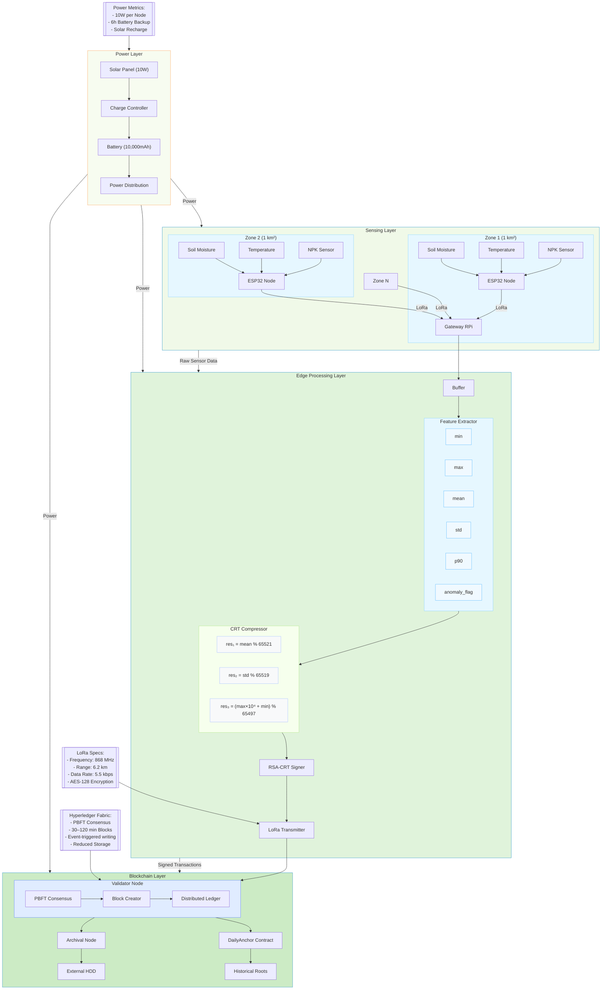

# Figure 1: Three-Tier System Architecture



### Key Components Explained

#### 1. Power Layer
- **Solar Panel**: 10W polycrystalline
- **Charge Controller**: PWM-based regulation
- **Battery**: LiFePO₄ 10,000mAh @ 3.2V
- **Distribution**: 5V DC to all nodes
- *Runtime*: 6 hours continuous operation

#### 2. Sensing Layer (Per 1 km² Zone)
- **Soil Moisture Sensor**: Capacitive V1.2 (±3% accuracy)
- **Temperature Sensor**: DS18B20 (±0.5°C accuracy)
- **NPK Sensor**: JXCT-IoT (N/P/K detection)
- **ESP32**: dual-core 240 MHz, 520 KB RAM
- **LoRa Module**: SX1278 (20 dBm output)
- *Reporting Modes*: periodic 30–120 min updates or instant alerts on threshold breaches

#### 3. Edge Processing Layer
- **Feature Extractor**:
  ```python
  features = {
    'min': np.min(window),
    'max': np.max(window),
    'mean': np.mean(window),
    'std': np.std(window),
    'p90': np.percentile(window, 90),
    'anomaly': 1 if std > 15 else 0
  }
  ```
- **CRT Compressor**:
  ```c
  residues[0] = (uint16_t)(mean * 100) % 65521;
  residues[1] = (uint16_t)(std * 100) % 65519;
  residues[2] = (uint16_t)((max * 10000) + min) % 65497;
  ```
- **RSA-CRT Signer**: 2048-bit keys, 78 ms signing time
- *Output*: 46-byte signed AgriBlock

#### 4. Blockchain Layer
- **Validator Node**:
  - PBFT consensus with 3-phase commit
  - Block creation every 5 seconds
- **DailyAnchor Contract**:
  ```solidity
  struct DailyRoot {
    bytes32 merkleRoot;
    uint256 timestamp;
    bytes32 prevRoot;
  }
  ```
- **Archival Node**:
  - RocksDB storage with Zstd compression
  - Daily rsync to external HDD
- *Storage Efficiency*: 225 KB/day per 100 zones

### Data Flow Sequence
1. **Sensing**: 10-second sensor reads → 30-min windows (180 samples)
2. **Edge Processing**:
   - Feature extraction → CRT compression → RSA signing
   - LoRa transmission to gateway
3. **Blockchain**:
   - Transaction validation → PBFT consensus → Ledger storage
   - Daily Merkle root calculation and anchoring

### Performance Metrics
| **Parameter** | **Sensing** | **Edge** | **Blockchain** |
|---------------|-------------|----------|----------------|
| Power Draw | 2.1W | 3.5W | 4.2W |
| Data Output | 1440B/window | 46B/window | 32B/day (root) |
| Processing Time | N/A | 85 ms | 420 ms |
| Network Load | 0.5% duty cycle | 12 KB/hr | 8 KB/hr |

### Innovative Features
1. **Hybrid Compression**:
   - Temporal downsampling (180:1)
   - CRT numerical encoding (12:1)
2. **Fault Tolerance**:
   - Battery-backed operation during cloud cover
   - PBFT consensus tolerates 1/3 node failures
3. **Resource Optimization**:
   - Anomaly-driven irrigation commands
   - Solar-powered off-grid deployment

This revised architecture diagram provides complete technical visibility into the AgriCrypt-Chain system, highlighting the power management, sensor-to-blockchain data flow, and cryptographic processing stages essential for large-scale agricultural monitoring. The color-coded layers and annotated specifications enable clear understanding of the system's operation in resource-constrained environments.
