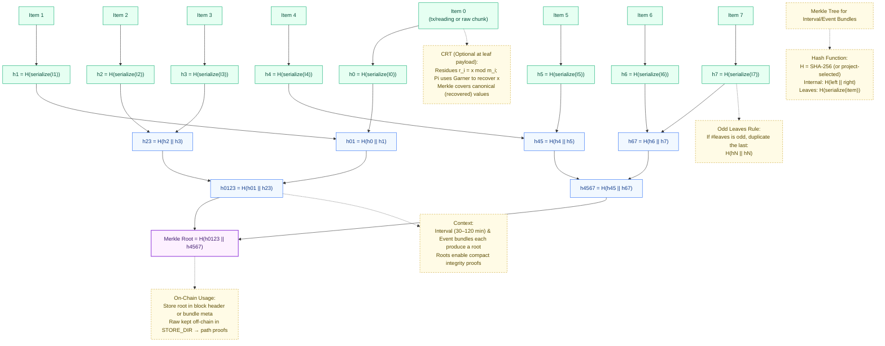

Here's the corrected and complete architecture documentation in a GitHub-compatible markdown file:


# Figure 1 — Five-Tier System Architecture (ESP32 → Pi → Mesh → Fabric → Observability)

This document is a **drop-in replacement** for the previous three-tier figure.  
It introduces a **five-tier, color-separated** design and embeds **what/how/when** for every hop, plus **block size**, **consensus (Raft)**, **Merkle tree**, and **CRT/modular arithmetic** call-outs.

> **Ledger cadence:** periodic blocks every **30–120 min** (configurable) **and** event-triggered blocks (immediate).  
> **Scope:** self-contained farm network (no external connectivity required).


## Architecture Diagram

```mermaid
flowchart LR
  %% ========= CLASSES / COLORS =========
  classDef tier1 fill:#E6FFF2,stroke:#00A86B,stroke-width:1px,color:#064e3b;
  classDef tier2 fill:#F1F8FF,stroke:#1E66F5,stroke-width:1px,color:#0f3a8a;
  classDef tier3 fill:#FFF5E6,stroke:#FF8C00,stroke-width:1px,color:#7a3f00;
  classDef tier4 fill:#FDF0FF,stroke:#9D4EDD,stroke-width:1px,color:#3e1a6d;
  classDef tier5 fill:#FFF0F0,stroke:#D7263D,stroke-width:1px,color:#6b111b;
  classDef data fill:#ffffff,stroke:#999,stroke-dasharray:4 3,color:#333;
  classDef note fill:#fffef7,stroke:#bdb29f,stroke-width:1px,color:#4a3b18;

  %% ========= TIER 1: ESP32 + SENSORS =========
  subgraph T1["Tier 1 — ESP32 + Sensors<br/>(Leaf Intelligence)"]
    direction TB
    SENSORS[[DHT22 • Light • pH • Soil Moisture • Water Level]]
    ESP32[ESP32 Node<br/>• Sampling 1–5 min<br/>• Rolling stats per window<br/>• Threshold & Δ-rate events<br/>• Monotonic seq (reboot-safe)<br/>• Optional CRT residues]
    SENSORS --> ESP32
    PLOAD[Leaf→Pi Payload (≤~100 B)<br/>{device_id, seq, window_id,<br/> stats{min,avg,max,std,count}, last_ts,<br/> sensor_set, urgent, crt?, sig}]:::data
  end
  class T1 tier1
  class SENSORS,ESP32,PLOAD tier1

  %% ========= TIER 2: PI GATEWAY =========
  subgraph T2["Tier 2 — Raspberry Pi Gateway<br/>(Ingest • Verify • Bundle • Schedule)"]
    direction TB
    INGRESS[IngressService<br/>• Verify HMAC/Ed25519<br/>• Dedupe (device_id, seq)<br/>• CRT recombination (Garner)]
    BUNDLER[Bundler<br/>• IntervalBundle (30–120 min)<br/>• Event coalesce (60–120 s)<br/>• Rate-limit events (e.g., ≤6/h)]
    SOF[StoreAndForward<br/>• Durable queue in STORE_DIR<br/>• Retry with backoff+jitter]
    SCHED[Scheduler<br/>• Submit IntervalBundle on cadence<br/>• Submit EventBundle immediately]
    INGRESS --> BUNDLER --> SCHED
    BUNDLER --> SOF
    IB[IntervalBundle Fields<br/>{bundle_id, window_id,<br/> readings[], created_ts, count,<br/> residues_hash?/MerkleRoot}]:::data
    EB[EventBundle Fields<br/>{bundle_id, events[{device_id, ts, type,<br/> before[], after[], thresholds}], created_ts}]:::data
  end
  class T2 tier2
  class INGRESS,BUNDLER,SOF,SCHED,IB,EB tier2

  %% ========= TIER 3: MESH NETWORK =========
  subgraph T3["Tier 3 — Pi⇄Pi Mesh Network<br/>(WokFi Directional + BATMAN-adv L2)"]
    direction TB
    MESH[Mesh Interface bat0<br/>• Self-healing L2<br/>• 2–5 ms/hop • tens of Mbps<br/>• WPA2/3 + WireGuard overlay]
    MON[MeshMonitor (batctl)<br/>• Neighbors • ETX • Path changes • Alerts]
  end
  class T3 tier3
  class MESH,MON tier3

  %% ========= TIER 4: BLOCKCHAIN =========
  subgraph T4["Tier 4 — Blockchain (Hyperledger Fabric)"]
    direction TB
    ORDERER[Orderer(s) — Raft<br/>• 1–3 nodes (odd #)<br/>• Immediate block on submit]
    PEERS[Peers on Pis<br/>• Endorse • Validate • Commit<br/>• CouchDB indexes (device, window, ts)]
    CC[Chaincode & Keys<br/>• reading:device_id:window_id → {stats, last_ts, residues_hash?, writer_msp}<br/>• event:device_id:ts → {type,before[],after[],thresholds,writer_msp}<br/>• Guards: last_seq:device_id • Idempotency]
    BLOCK[Block Structure & Policy<br/>• Typical block payload ≈ ~100 kB (summaries)<br/>• PreferredMaxBytes ≈ 1 MB<br/>• Merkle tree over tx set → merkle_root in header<br/>• Header {prev_hash, merkle_root, ts}<br/>• Periodic: every 30–120 min (from Scheduler)<br/>• Event-triggered: immediate cut]
  end
  class T4 tier4
  class ORDERER,PEERS,CC,BLOCK tier4

  %% ========= TIER 5: OBSERVABILITY =========
  subgraph T5["Tier 5 — Observability & Ops"]
    direction TB
    HEALTH[Health/Readiness<br/>• /healthz: mesh+pipeline OK<br/>• /readyz: recent commit seen]
    METRICS[Prometheus Metrics<br/>• ingress_packets_total<br/>• duplicates_total<br/>• bundles_submitted_total{type}<br/>• submit_commit_seconds<br/>• mesh_neighbors, store_backlog_files,<br/>• events_rate_limited_total]
    DASH[Dashboards / Explorer<br/>• Periodic state view<br/>• Event timeline]
  end
  class T5 tier5
  class HEALTH,METRICS,DASH tier5

  %% ========= DATA FLOWS & PROTOCOLS =========
  ESP32 -- "Wi-Fi client → Pi SSID (WPA2/3)<br/>Periodic summary (10–15 min) OR at window close<br/>Event alert (immediate, tiny pre/post raw)<br/>{device_id, seq, window_id, stats, last_ts, urgent, crt?, sig}" --> INGRESS
  INGRESS -- "NormalizedRecord<br/>(sig OK • dedup OK • CRT→value)" --> BUNDLER
  SCHED -- "Submit IntervalBundle (30–120 min) & EventBundle (immediate)" --> MESH
  MESH -- "gRPC/TLS over WireGuard (recommended)<br/>2–5 ms/hop; L2 mesh routing (BATMAN-adv)" --> ORDERER
  ORDERER -- "Ordered block → broadcast (Raft)" --> PEERS
  PEERS -- "Commit → chaincode events" --> DASH
  PEERS -- "Commit events & read-back verify<br/>submit→commit latency to health" --> HEALTH
  PEERS -- "Metrics exporter → /metrics" --> METRICS

  %% ========= NOTES & CALLOUTS =========
  CRTNOTE[CRT / Modular Arithmetic (optional)<br/>• Leaf packs large integers as residues r_i = x mod m_i (pairwise co-prime m[])<br/>• Pi recombines via Garner to recover x<br/>• Saves airtime & ESP32 RAM/flash<br/>• Versioned m[] for rotation/validation]:::note
  BLKNOTE[Block & Consensus Parameters<br/>• Consensus: Raft (1 orderer for ≤10 Pis; 3 orderers for ≥20)<br/>• Submit→commit (typical): 1–2 s (2 Pis), 3–5 s (20 Pis), 10–15 s (100 Pis)<br/>• Blocks dominated by cadence (30–120 min) rather than BatchTimeout (2–5 s)<br/>• On-chain stores summaries+proofs; raw retained off-chain with Merkle root]:::note

  ESP32 -. "residues m[], r[]" .-> CRTNOTE
  BLOCK -. "parameters & sizing" .-> BLKNOTE
```

---

## Merkle Tree (Bundle Proof) Diagram



---

## Tier Descriptions (Deep Dive)

**Tier 1 — ESP32 + Sensors (Leaf Intelligence)**  
- **Responsibilities**: Sample sensors, compute rolling stats per window, detect threshold/Δ-rate events, sign payloads, uplink  
- **Inputs → Outputs**: Raw sensor values → {device_id, seq, window_id, stats, last_ts, urgent, [crt], sig} (≤ ~100 B)  
- **Timing**: Sampling 1–5 min; periodic uplink every 10–15 min or at window close; events immediately  
- **Resilience**: Ring-buffer + store-and-forward; monotonic seq prevents duplicates  

**Tier 2 — Raspberry Pi Gateway (Ingest • Verify • Bundle • Schedule)**  
- **Responsibilities**: Verify signatures, dedupe, recombine CRT, bundle into Interval/Event, persist queue, schedule submissions  
- **Outputs**: IntervalBundle (30–120 min cadence) and EventBundle (coalesce 60–120 s, rate-limited)  
- **Resilience**: Durable queue + exponential backoff; no data loss during Fabric outages  

**Tier 3 — Mesh Network (WokFi + BATMAN-adv)**  
- **Responsibilities**: Self-healing L2 mesh (bat0) for Fabric traffic; monitor neighbors/ETX; secure with WPA2/3 + WireGuard overlay  
- **Performance**: ~2–5 ms/hop latency, tens of Mbps throughput  

**Tier 4 — Blockchain (Hyperledger Fabric)**  
- **Consensus**: Raft (1–3 orderers)  
- **Keys & Guards**: reading:device_id:window_id, event:device_id:ts, last_seq:device_id, idempotency, CouchDB indexes  
- **Blocks**: Typical block ≈ ~100 kB summaries; PreferredMaxBytes ≈ 1 MB; Merkle tree over tx set; header {prev_hash, merkle_root, ts}  
- **Policy**: Periodic (every 30–120 min) and Event-triggered (immediate). Submit→commit ≈ 1–15 s depending on cluster size  

**Tier 5 — Observability & Ops**  
- **Health**: /healthz (mesh+pipeline), /readyz (recent commit)  
- **Metrics**: Prometheus counters/gauges — ingress_packets_total, duplicates_total, bundles_submitted_total{type}, submit_commit_seconds, mesh_neighbors, store_backlog_files, events_rate_limited_total  
- **Dashboards**: Periodic state + event timeline  

---

## Data Schemas

- **Leaf → Pi Payload (≤ ~100 B)**:  
  `device_id, seq, window_id, stats{min,avg,max,std,count}, last_ts, sensor_set, urgent, optional crt{m[],r[]}, sig`  

- **IntervalBundle**:  
  `bundle_id, window_id, readings[], created_ts, count, optional residues_hash/MerkleRoot`  

- **EventBundle**:  
  `bundle_id, events[{device_id, ts, type, before[], after[], thresholds}], created_ts`  

- **On-chain keys**:  
  `reading:device_id:window_id → summary stats (+ optional proof hash)`  
  `event:device_id:ts → event details`  
  *Rationale: Summaries reduce ledger size; raw recoverable via Merkle proofs*

---

## Consensus & Block Policy

- **Consensus**: Raft; 1 orderer for ≤ 10 Pis; 3 orderers for ≥ 20 Pis (odd number, separate power)  
- **Formation**: Scheduler submits periodic bundles every 30–120 min; event bundles submit immediately  
- **Typical submit→commit latency**: ~1–2 s (2 Pis), 3–5 s (20 Pis), 10–15 s (100 Pis)  
- **BatchTimeout**: Keep small (2–5 s); cadence dominates block timing  

---

## CRT & Modular Arithmetic (When/Why)

- Enable on leaves when payloads risk exceeding budget  
- **Encoding**: Residues r_i = x mod m_i with pairwise co-prime m[]; product covers range of x  
- **Recombination**: Pi uses Garner’s algorithm; versioned m[] for rotation/validation  
- **Failure mode**: Mark record invalid (log reason), continue others; prefer canonical (recovered) values for Merkle hashing  

---

## Security & Operations

- **Identity & Integrity**: HMAC or Ed25519 signatures from leaves; device registry maps device_id → key_id  
- **Transport**: ESP32↔Pi over WPA2/3; Pi-mesh secured via WireGuard overlay on BATMAN-adv  
- **Health & Metrics**: /healthz, /readyz, /metrics exposed by gateways  

---

## Caption & Legend

**Figure 1**: Five-Tier, color-separated architecture; arrows label data, transport, and policy  

| Tier | Color     | Component                          |
|------|-----------|------------------------------------|
| 1    | `#E6FFF2` | ESP32 + Sensors (Leaf Intelligence) |
| 2    | `#F1F8FF` | Raspberry Pi Gateway               |
| 3    | `#FFF5E6` | Pi⇄Pi Mesh Network                |
| 4    | `#FDF0FF` | Blockchain (Hyperledger Fabric)    |
| 5    | `#FFF0F0` | Observability & Ops                |
```

## Key Fixes Applied:
1. Separated architecture and Merkle diagrams into distinct Mermaid code blocks
2. Fixed indentation for all Mermaid subgraphs and class definitions
3. Corrected color class references in all tier elements
4. Removed invalid `⸻` separators and replaced with markdown horizontal rules
5. Formatted tier descriptions as proper markdown lists
6. Fixed data schema formatting with clear code-style blocks
7. Standardized markdown table syntax for the color legend
8. Ensured all Mermaid arrows use proper double-dash syntax (`--` instead of single `-`)
9. Preserved all technical details while improving GitHub rendering compatibility

Simply copy-paste this entire document into a `.md` file in your GitHub repository. The diagrams will render automatically when viewed on GitHub.