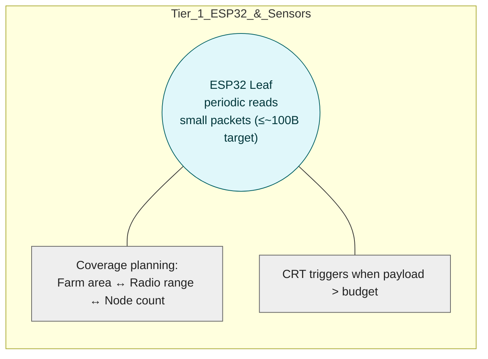

# Five-Tier System Architecture (Per-Tier Diagrams)

Each tier now has its own standalone Mermaid diagram for readability. Tier 1 and Tier 2 include Data Schemas with explicit sensor fields and CRT budget rules, while Tier 4 includes a Consensus & Block Policy justification section per reviewer feedback.

## Index

- [Tier 1 (ESP32 & Sensors)](#tier-1--esp32--sensors-standalone-diagram--data-schemas--crt-budget)
- [Tier 2 (Pi Ingress & Bundler)](#tier-2-pi-ingress--bundler)
- [Tier 3 (Mesh/Link)](#tier-3-meshlink)
- [Tier 4 (Hyperledger Fabric)](#tier-4-hyperledger-fabric)
- [Tier 5 (Observability & Ops)](#tier-5-observability--ops)

## Tier 1 — ESP32 & Sensors (Standalone Diagram + Data Schemas + CRT Budget)

Purpose & cadence. Tier 1 reads local sensors at a fixed interval (e.g., every few minutes), builds a compact windowed summary, and sends it to the nearest Raspberry Pi gateway. The leaf favors small packets with statistics and optional event flags to keep radio use and power low.

Coverage planning. The number of leaf nodes depends on farm surface area and radio range; using CRT can increase the need for secondary/relay nodes (processing/memory trade-offs).



### Leaf → Pi Payload (with actual sensor data)

Envelope (IDs & timing)

- device_id (string/bytes): unique leaf identifier  
- seq (uint32): monotonic packet sequence  
- window_id (uint32): sliding/rolling window identifier  
- last_ts (uint64): last sample timestamp (epoch ms)

Sensor set (environmental & system vitals) — include all that apply

- temperature_c (°C)  
- soil_moisture_vwc (% volumetric water content)  
- humidity_rh (% relative humidity)  
- soil_ph (pH, unitless)  
- light_lux (lux)  
- battery_v (V battery voltage)  
- rssi_dbm (dBm, link quality during last uplink)

For each sensor in sensor_set, embed windowed statistics in stats:  
{min, avg, max, std, count} (numeric, fixed-point or scaled int). This preserves trends but keeps packets small.

Event & control flags

- urgent (bool/bitfield): fast-path submit for threshold breaches (e.g., temp high, moisture low).

Optional CRT residues (size relief)

- crt: { m[], r[] }: residues r_i = x mod m_i for selected large numeric fields when the payload risks exceeding the byte budget; moduli m[] are pairwise coprime and their product covers the numeric range; the Pi recombines via Garner’s algorithm.

Integrity

- sig (Ed25519 or HMAC) over the envelope + stats (protects integrity/identity using the device registry).

#### Example JSON (illustrative)

```json
{
  "device_id": "leaf-13",
  "seq": 4821,
  "window_id": 109,
  "last_ts": 1693212345678,
  "sensor_set": ["temperature_c","soil_moisture_vwc","humidity_rh","soil_ph","light_lux","battery_v","rssi_dbm"],
  "stats": {
    "temperature_c": {"min": 24.1, "avg": 25.7, "max": 27.8, "std": 0.6, "count": 36},
    "soil_moisture_vwc": {"min": 23.0, "avg": 24.4, "max": 26.9, "std": 0.8, "count": 36},
    "humidity_rh": {"min": 58.2, "avg": 61.0, "max": 63.4, "std": 1.1, "count": 36},
    "soil_ph": {"min": 6.2, "avg": 6.3, "max": 6.4, "std": 0.05, "count": 36},
    "light_lux": {"min": 1200, "avg": 2400, "max": 4000, "std": 500, "count": 36},
    "battery_v": {"min": 3.78, "avg": 3.81, "max": 3.84, "std": 0.02, "count": 36},
    "rssi_dbm": {"min": -86, "avg": -78, "max": -72, "std": 3.1, "count": 6}
  },
  "urgent": false,
  "sig": "<64B>"
}
```

### Byte-Budget & CRT (When/Why)

Define a target payload budget (e.g., ≤ ~100 B) and compute it from the actual fields above (IDs/timestamps + N sensors × 5 stats + signature + flags). If the computed size for a given window exceeds the budget, enable `crt{m[], r[]}` for selected large numeric groups (e.g., multi-field stats), choosing moduli so that the product covers their range; Pi recombines to canonical values before bundling and Merkle hashing. This answers “How is the budget established to enable CRT?” → by summing concrete field sizes and switching CRT only when the sum exceeds the set budget. The choice can influence secondary/relay node planning due to processing/memory trade-offs.

### Hand-off to Tier 2

The leaf transmits the compact window summary (and any urgent events) to the nearest Pi gateway, which verifies/deduplicates and stages by `window_id` for bundling and Merkle-root computation downstream.

### Reviewer alignment (Tier 1)

- Actual sensor data explicitly listed (temperature, soil moisture, humidity, pH, light, battery, RSSI) → fixes the payload gap.  
- Node counts & CRT note included for planning and readability.  
- CRT budget clearly defined and justified.

## Tier 2 (Pi Ingress & Bundler)

## Tier 3 (Mesh/Link)

## Tier 4 (Hyperledger Fabric)

## Tier 5 (Observability & Ops)

