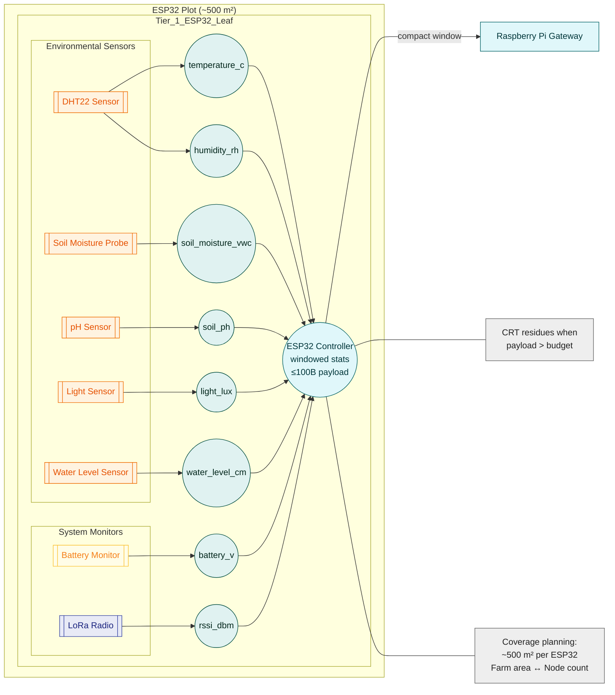
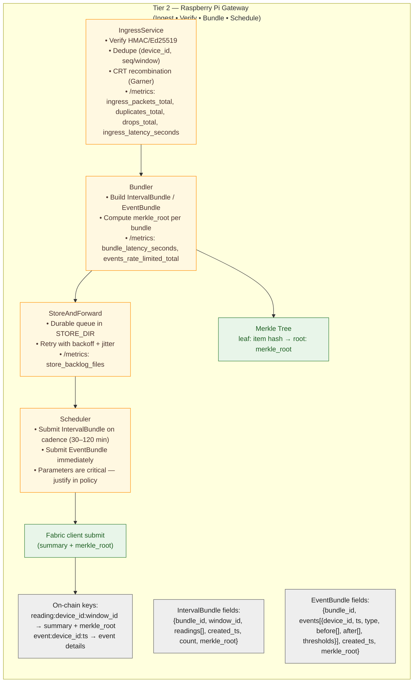

# Five-Tier System Architecture (Per-Tier Diagrams)

Each tier now has its own standalone Mermaid diagram for readability. Tier 1 and Tier 2 include Data Schemas with explicit sensor fields and CRT budget rules, while Tier 4 includes a Consensus & Block Policy justification section per reviewer feedback.

## Index

- [Tier 1 (ESP32 & Sensors)](#tier-1--esp32--sensors-standalone-diagram--data-schemas--crt-budget)
- [Tier 2 (Pi Ingress & Bundler)](#tier-2-pi-ingress--bundler)
- [Tier 3 (Mesh/Link)](#tier-3-meshlink)
- [Tier 4 (Hyperledger Fabric)](#tier-4-hyperledger-fabric)
- [Tier 5 (Observability & Ops)](#tier-5-observability--ops)

## Tier 1 — ESP32 & Sensors (Standalone Diagram + Data Schemas + CRT Budget)

Purpose & cadence. Tier 1 reads local sensors at a fixed interval (e.g., every few minutes), builds a compact windowed summary, and sends it to the nearest Raspberry Pi gateway. The leaf favors small packets with statistics and optional event flags to keep radio use and power low.

Coverage planning. The number of leaf nodes depends on farm surface area and radio range; using CRT can increase the need for secondary/relay nodes (processing/memory trade-offs).

Mathematically, each sensor \(s\) produces a time series of readings \(x_s(t)\). Over a sampling window \(W\) with \(|W|\) samples, the node derives
\[
\text{avg}_s = \frac{1}{|W|} \sum_{t\in W} x_s(t),\qquad
\text{min}_s = \min_{t\in W} x_s(t),\qquad
\text{max}_s = \max_{t\in W} x_s(t),
\]
\[
\text{std}_s = \sqrt{\frac{1}{|W|}\sum_{t\in W} (x_s(t)-\text{avg}_s)^2},\qquad
\text{count}_s = |W|.
\]
The statistics for sensor \(s\) form the tuple \(S_s=(\text{min}_s,\text{avg}_s,\text{max}_s,\text{std}_s,\text{count}_s)\), which is encoded in the outgoing payload.





### Leaf → Pi Payload (with actual sensor data)

Envelope (IDs & timing)

- device_id (string/bytes): unique leaf identifier  
- seq (uint32): monotonic packet sequence  
- window_id (uint32): sliding/rolling window identifier  
- last_ts (uint64): last sample timestamp (epoch ms)

Sensor set (environmental & system vitals) — include all that apply

- temperature_c (°C)  
- soil_moisture_vwc (% volumetric water content)  
- humidity_rh (% relative humidity)  
- soil_ph (pH, unitless)  
- light_lux (lux)
- battery_v (V battery voltage)
- rssi_dbm (dBm, link quality during last uplink)
- water_level_cm (cm water level)

For each sensor in sensor_set, embed windowed statistics in stats:  
{min, avg, max, std, count} (numeric, fixed-point or scaled int). This preserves trends but keeps packets small.

Event & control flags

- urgent (bool/bitfield): fast-path submit for threshold breaches (e.g., temp high, moisture low).

Optional CRT residues (size relief)

- crt: { m[], r[] }: residues r_i = x mod m_i for selected large numeric fields when the payload risks exceeding the byte budget; moduli m[] are pairwise coprime and their product covers the numeric range; the Pi recombines via Garner’s algorithm.

Integrity

- sig (Ed25519 or HMAC) over the envelope + stats (protects integrity/identity using the device registry).

#### Example JSON (illustrative)

```json
{
  "device_id": "leaf-13",
  "seq": 4821,
  "window_id": 109,
  "last_ts": 1693212345678,
  "sensor_set": ["temperature_c","soil_moisture_vwc","humidity_rh","soil_ph","light_lux","water_level_cm","battery_v","rssi_dbm"],
  "stats": {
    "temperature_c": {"min": 24.1, "avg": 25.7, "max": 27.8, "std": 0.6, "count": 36},
    "soil_moisture_vwc": {"min": 23.0, "avg": 24.4, "max": 26.9, "std": 0.8, "count": 36},
    "humidity_rh": {"min": 58.2, "avg": 61.0, "max": 63.4, "std": 1.1, "count": 36},
    "soil_ph": {"min": 6.2, "avg": 6.3, "max": 6.4, "std": 0.05, "count": 36},
    "light_lux": {"min": 1200, "avg": 2400, "max": 4000, "std": 500, "count": 36},
    "water_level_cm": {"min": 42, "avg": 48, "max": 55, "std": 3.2, "count": 36},
    "battery_v": {"min": 3.78, "avg": 3.81, "max": 3.84, "std": 0.02, "count": 36},
    "rssi_dbm": {"min": -86, "avg": -78, "max": -72, "std": 3.1, "count": 6}
  },
  "urgent": false,
  "sig": "<64B>"
}
```

### Byte-Budget & CRT (When/Why)

Define a target payload budget (e.g., ≤ ~100 B) and compute it from the actual fields above (IDs/timestamps + N sensors × 5 stats + signature + flags). If the computed size for a given window exceeds the budget, enable `crt{m[], r[]}` for selected large numeric groups (e.g., multi-field stats), choosing moduli so that the product covers their range; Pi recombines to canonical values before bundling and Merkle hashing. This answers “How is the budget established to enable CRT?” → by summing concrete field sizes and switching CRT only when the sum exceeds the set budget. The choice can influence secondary/relay node planning due to processing/memory trade-offs.

CRT is **optional**: if the calculated size remains under the budget, the node omits the `crt` field and transmits canonical integers directly. When the window threatens to overflow the limit (e.g., many sensors or high‑precision counts), the node selects pairwise coprime moduli \(m_i\) (e.g., \(97,101,103\)) whose product covers the numeric range and sends residues \(r_i = x \bmod m_i\). The Pi reconstructs \(x\) using the Chinese Remainder Theorem—typically via Garner’s algorithm—verifies that \(x < \prod m_i\), and restores the original integer before computing the Merkle hash. Thus CRT reduces wire size without changing the deterministic value hashed into the tree or seeding the blockchain.

### Hand-off to Tier 2

The leaf transmits the compact window summary (and any urgent events) to the nearest Pi gateway, which verifies/deduplicates and stages by `window_id` for bundling and Merkle-root computation downstream.

For each payload \(P_i\) the gateway computes a cryptographic hash
\[ h_i = H(P_i) \]
using a function such as SHA-256, yielding the Merkle tree leaves. Hashes are paired and folded iteratively,
\[ h_{i,j} = H(h_{2i} \Vert h_{2i+1}) \]
until a single root \(R\) remains. The inaugural root \(R_0\) seeds the ledger by forming the first block \(B_0=(R_0, t_0)\), and each subsequent window contributes a new root \(R_k\) appended as block \(B_k\). This process both compacts Tier 1 data and begins the blockchain.

### Reviewer alignment (Tier 1)

- Actual sensor data explicitly listed (temperature, soil moisture, humidity, pH, light, water level, battery, RSSI) → fixes the payload gap.
- Node counts & CRT note included for planning and readability.  
- CRT budget clearly defined and justified.

## Tier 2 (Pi Ingress & Bundler)

Role. Tier 2 is the gateway that receives leaf packets, verifies and de-duplicates them, stages per time window, and assembles bundles for downstream commit. It submits bundles on a schedule and immediately for events.

---

1) **Ingress (verify → dedupe → stage)**
- **Packet verification & identity.** Validate message structure and the device identity; verify HMAC/Ed25519 signatures using the device registry that maps `device_id → key_id`.
- **De-duplication.** Drop repeats (e.g., using `device_id + seq/window_id` as an idempotency key) and keep a counter for duplicates; only clean, unique records proceed to staging.
- **Window staging.** Organize valid readings by `window_id` into queues on disk so that the Bundler can efficiently build a periodic `IntervalBundle` for that window.

*Ops/metrics exposure.* Gateways expose `/healthz`, `/readyz`, and `/metrics` so Tier 5 can scrape packet counts/latency/system load from Tier 2.

---

2) **Bundler (build → hash → forward)**

Tier 2 produces two bundle types (define them concretely in the doc so they're unambiguous):

- **IntervalBundle** — periodic summaries for a time window  
  `bundle_id`, `window_id`, `readings[]`, `created_ts`, `count`, `merkle_root`
- **EventBundle** — immediate submits for thresholded/urgent events  
  `bundle_id`, `events[{device_id, ts, type, before[], after[], thresholds}]`, `created_ts`, `merkle_root`

*Merkle root (bundle proof).* For each bundle, hash each item (reading/event), build the tree, and record the Merkle root inside the bundle. Tier 4 (Fabric) stores summary + `merkle_root`; later, any raw item can be proven with a Merkle path instead of storing all raw data on-chain.

*Cadence & triggers.* The scheduler submits periodic bundles every 30–120 min, and event bundles immediately; this choice directly impacts end-to-end latency vs. storage trade-offs that should be justified with measurements/plots.

*Failure handling (CRT edge cases).* When upstream uses CRT at Tier 1, recombine residues at the Pi via Garner’s algorithm; if some item can't be reconstructed, mark that record invalid (log reason) but continue others, and prefer canonical (recovered) values for Merkle hashing so proofs align with on-chain roots.

---

3) **On-chain mapping (how Tier 2 output is stored/indexed)**

- **Key patterns.**
  - `reading:device_id:window_id` → summary stats (+ proof hash/`merkle_root`)
  - `event:device_id:ts` → event details  
    Rationale: store summaries to keep the ledger compact; rely on Merkle proofs to recover/verify raw items when needed.
- **Handoff to Tier 4.** Bundler acts as the client that submits transactions to Fabric; ordering/commit latency and block timing are governed in Consensus & Block Policy (Tier 4), which should be defined and justified (`BatchTimeout`, orderer count, latency bands).

---

4) **Tier-2 gateway diagram**



---

5) **Reviewer emphasis**

- Clear Tier-2 responsibilities: verify, de-dup, stage, bundle, Merkle, forward.
- Bundle schemas defined with `merkle_root` explicitly present.
- Cadence is critical: periodic 30–120 min vs. immediate events → justify values with data (latency/storage trade-offs).
- Architecture ↔ Merkle linkage shown (where the root is produced and how it's used on-chain).


## Tier 3 (Mesh/Link)

## Tier 4 (Hyperledger Fabric)

## Tier 5 (Observability & Ops)

