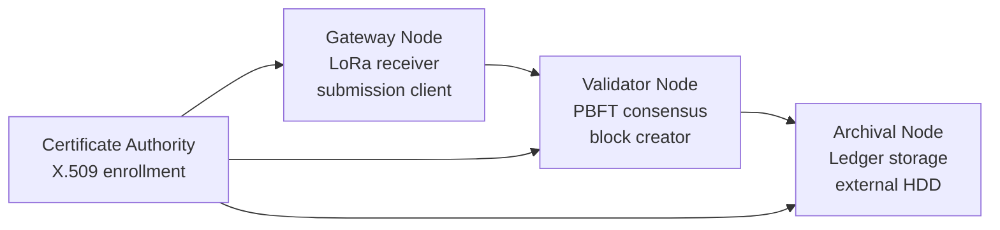

# Figure 2: Hyperledger Network Topology

```mermaid
flowchart LR
    gateway[Gateway Node\nLoRa receiver\nsubmission client]
    validator[Validator Node\nPBFT consensus\nblock creator]
    archival[Archival Node\nLedger storage\nexternal HDD]
    ca[Certificate Authority\nX.509 enrollment]

    gateway --> validator --> archival
    ca --> gateway
    ca --> validator
    ca --> archival
```
