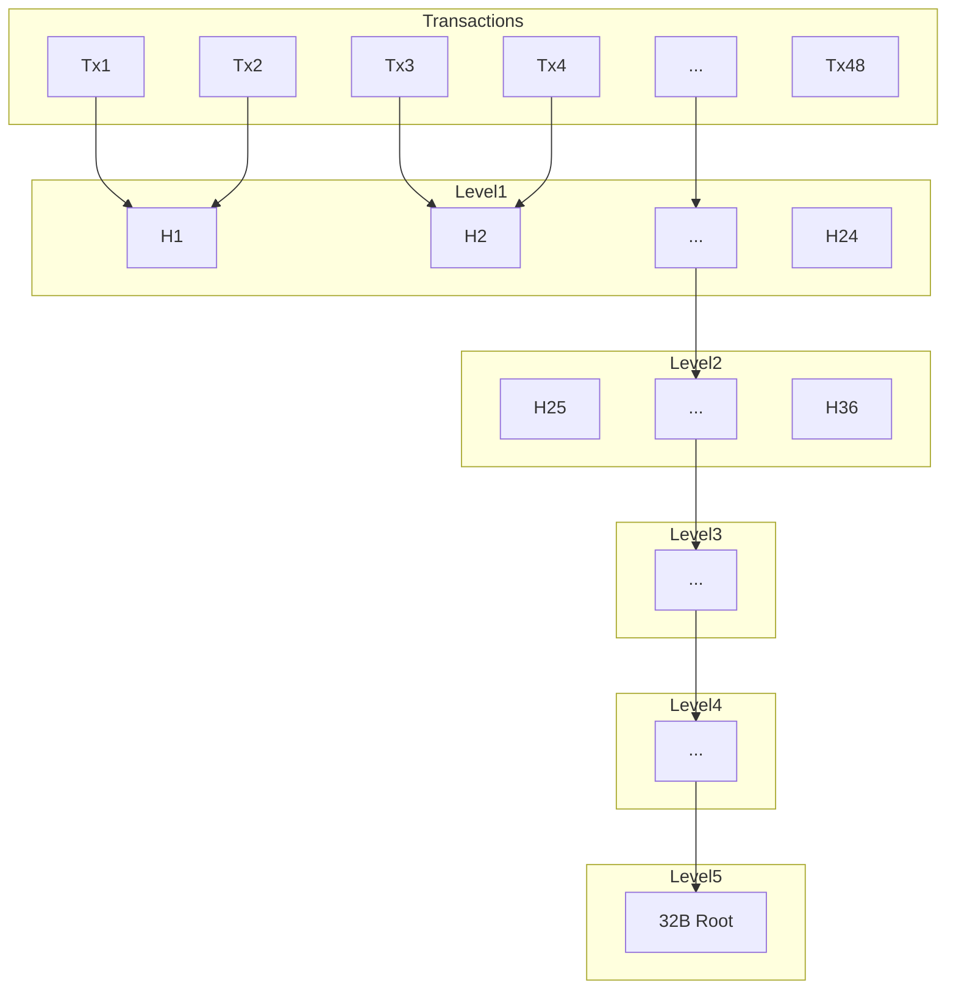

# Figure 3a: Merkle Tree Construction

```mermaid
flowchart TD
    subgraph Level0[Transactions]
        T1[Tx1]
        T2[Tx2]
        T3[Tx3]
        T4[Tx4]
        dots1[...] 
        T48[Tx48]
    end
    subgraph Level1
        H1[H1]
        H2[H2]
        dots2[...]
        H24[H24]
    end
    subgraph Level2
        H25[H25]
        dots3[...]
        H36[H36]
    end
    subgraph Level3
        dots4[...]
    end
    subgraph Level4
        dots5[...]
    end
    subgraph Level5
        Root[32B Root]
    end

    T1 --> H1
    T2 --> H1
    T3 --> H2
    T4 --> H2
    dots1 --> dots2
    dots2 --> dots3
    dots3 --> dots4
    dots4 --> dots5
    dots5 --> Root
```
