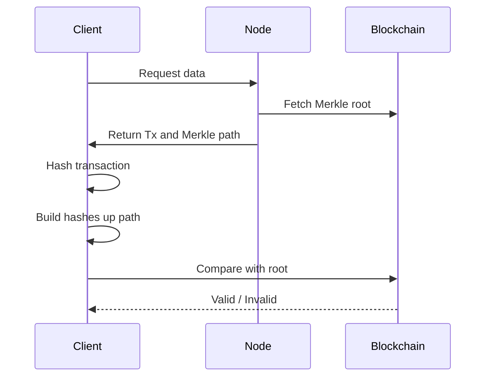

# Figure 3b: Verification Process

```mermaid
sequenceDiagram
    participant Client
    participant Node
    participant Blockchain
    Client->>Node: Request data
    Node->>Blockchain: Fetch Merkle root
    Node->>Client: Return Tx and Merkle path
    Client->>Client: Hash transaction
    Client->>Client: Build hashes up path
    Client->>Blockchain: Compare with root
    Blockchain-->>Client: Valid / Invalid
```
