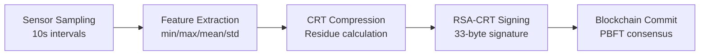

# Figure 4: Data Processing Pipeline

```mermaid
flowchart LR
    sample[Sensor Sampling\n10s intervals]
    extract[Feature Extraction\nmin/max/mean/std]
    compress[CRT Compression\nResidue calculation]
    sign[RSA-CRT Signing\n33-byte signature]
    commit[Blockchain Commit\nPBFT consensus]

    sample --> extract --> compress --> sign --> commit
```
