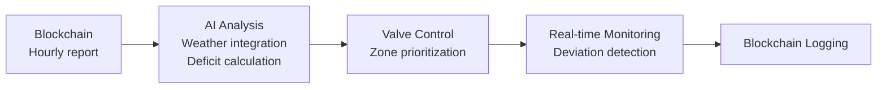

# Figure 5: Resource Allocation Workflow

```mermaid
flowchart LR
    report[Blockchain\nHourly report]
    analysis[AI Analysis\nWeather integration\nDeficit calculation]
    control[Valve Control\nZone prioritization]
    monitor[Real-time Monitoring\nDeviation detection]
    log[Blockchain Logging]

    report --> analysis --> control --> monitor --> log
```
