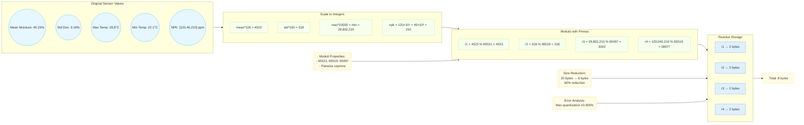

# Figure 6: CRT Compression Mechanics

```mermaid
graph LR
  %% ===== INPUT VALUES =====
  subgraph INPUT["Original Sensor Values"]
    direction TB
    V1(("Mean Moisture: 45.23%")):::input
    V2(("Std Dev: 3.18%")):::input
    V3(("Max Temp: 29.8°C")):::input
    V4(("Min Temp: 22.1°C")):::input
    V5(("NPK: [120,45,210] ppm")):::input
  end

  INPUT --> SCALE
  subgraph SCALE["Scale to Integers"]
    direction TB
    S1["mean*100 = 4523"]:::process
    S2["std*100 = 318"]:::process
    S3["max*10000 + min = 29,802,210"]:::process
    S4["npk = 120×10⁶ + 45×10³ + 210"]:::process
  end

  SCALE --> MOD
  subgraph MOD["Modulo with Primes"]
    direction TB
    M1["r1 = 4523 % 65521 = 4523"]:::process
    M2["r2 = 318 % 65519 = 318"]:::process
    M3["r3 = 29,802,210 % 65497 = 3002"]:::process
    M4["r4 = 120,045,210 % 65519 = 28977"]:::process
  end

  MOD --> STORE
  subgraph STORE["Residue Storage"]
    direction LR
    R1["r1 → 2 bytes"]:::output
    R2["r2 → 2 bytes"]:::output
    R3["r3 → 2 bytes"]:::output
    R4["r4 → 2 bytes"]:::output
  end

  STORE --> BYTES["Total: 8 bytes"]:::annot

  AN1[["Moduli Properties:\n- 65521, 65519, 65497\n- Pairwise coprime"]]:::annot --> MOD
  AN2[["Size Reduction:\n20 bytes → 8 bytes\n60% reduction"]]:::annot --> STORE
  AN3[["Error Analysis:\nMax quantization ±0.005%"]]:::annot --> STORE

  classDef input fill:#e6f7ff,stroke:#91d5ff,stroke-width:2px
  classDef process fill:#f6ffed,stroke:#b7eb8f,stroke-width:1px
  classDef output fill:#e0f0ff,stroke:#adc6ff,stroke-width:2px
  classDef annot fill:#fffbe6,stroke:#ffe58f,stroke-width:1px
```
