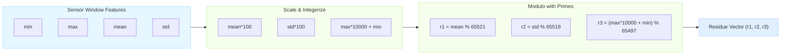

# Figure 6a: CRT Compression Process

```mermaid
flowchart LR
    subgraph INPUT["Sensor Window Features"]
        direction TB
        MIN[min]
        MAX[max]
        MEAN[mean]
        STD[std]
    end

    subgraph SCALE["Scale & Integerize"]
        direction TB
        SM["mean*100"]
        SS["std*100"]
        COMB["max*10000 + min"]
    end

    subgraph MOD["Modulo with Primes"]
        direction TB
        R1["r1 = mean % 65521"]
        R2["r2 = std % 65519"]
        R3["r3 = (max*10000 + min) % 65497"]
    end

    OUTPUT["Residue Vector (r1, r2, r3)"]

    INPUT --> SCALE --> MOD --> OUTPUT

    classDef input fill:#e6f7ff,stroke:#91d5ff
    classDef process fill:#f6ffed,stroke:#b7eb8f
    classDef output fill:#e0f0ff,stroke:#adc6ff

    class INPUT input
    class SCALE,MOD process
    class OUTPUT output
```
