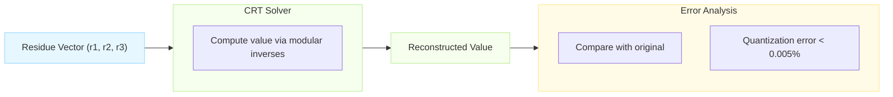

# Figure 6b: Reconstruction & Error Analysis

```mermaid
flowchart LR
    RES["Residue Vector (r1, r2, r3)"]:::input

    subgraph SOLVE["CRT Solver"]
        direction TB
        STEP1["Compute value via modular inverses"]
    end

    VAL["Reconstructed Value"]:::process

    subgraph CHECK["Error Analysis"]
        direction TB
        ERR["Compare with original"]
        BOUND["Quantization error < 0.005%"]
    end

    RES --> SOLVE --> VAL --> CHECK

    classDef input fill:#e6f7ff,stroke:#91d5ff
    classDef process fill:#f6ffed,stroke:#b7eb8f
    classDef verify fill:#fffbe6,stroke:#ffe58f

    class RES input
    class SOLVE,VAL process
    class CHECK verify
```
