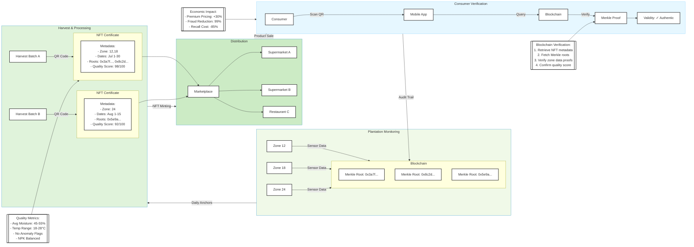
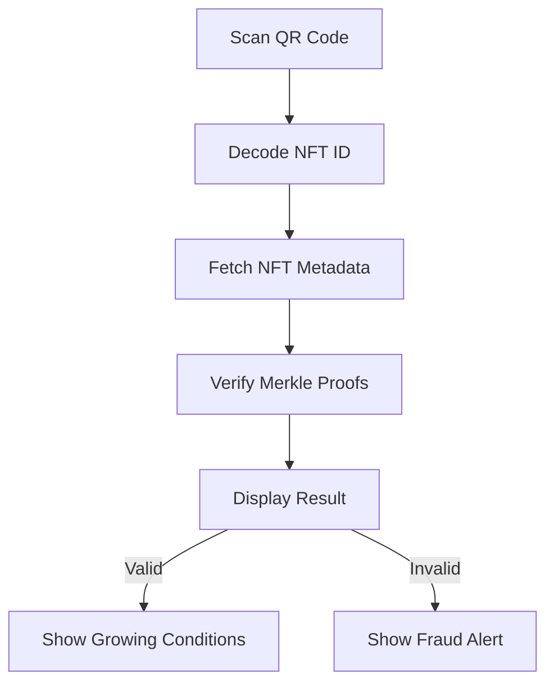
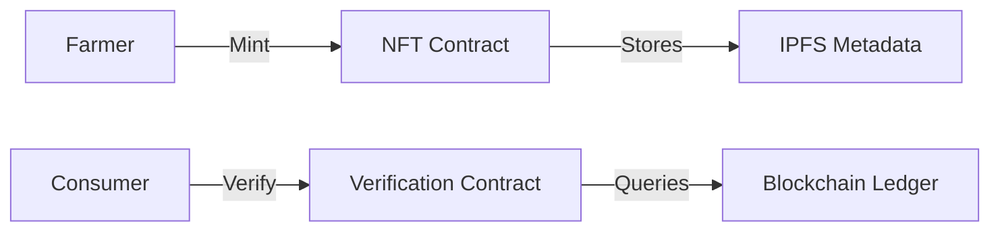

# Figure 7: Farm-to-Fork Traceability Framework



### Technical Specifications

#### 1. NFT Certificate Structure
```solidity
struct AgriNFT {
  uint256 tokenId;
  string produceType;       // "Tomato"
  uint256 harvestDate;
  uint256[] zoneIds;        // [12,18]
  bytes32[] merkleRoots;    // [0x3a7f..., 0x8c2d...]
  uint8 qualityScore;       // 0-100
  string storageConditions;
}
```

#### 2. Verification Protocol
```python
def verify_product(nft_id):
  # Retrieve NFT metadata
  nft = blockchain.get_nft(nft_id)
  
  # Verify each growth period
  for zone_id, root in zip(nft.zoneIds, nft.merkleRoots):
    # Get random transaction from period
    tx = blockchain.get_random_tx(zone_id, nft.harvestDate)
    
    # Generate Merkle proof
    proof = blockchain.get_merkle_proof(tx)
    
    # Verify inclusion
    if not verify_merkle_proof(tx, proof, root):
      return "Verification Failed"
  
  return "Authentic Product"
```

#### 3. Mobile App Workflow


### Data Provenance Elements

#### 1. Growth Condition Proofs
```json
{
  "zone": 12,
  "period": "2025-07-01 to 2025-07-30",
  "metrics": {
    "avg_moisture": 48.2,
    "max_temp": 28.7,
    "min_temp": 18.3,
    "anomaly_days": 0,
    "fertilizer_events": 3
  },
  "proof": {
    "merkle_root": "0x3a7f...",
    "tx_hash": "0x8e2a...",
    "path": ["0x5a1b...", "0x3c8d...", "0x9f2e..."]
  }
}
```

#### 2. Quality Scoring Algorithm
```python
def calculate_quality_score(zone_data):
  score = 100
  # Penalty for anomalies
  score -= zone_data['anomaly_days'] * 5
  # Bonus for optimal ranges
  if 45 < zone_data['avg_moisture'] < 55:
    score += 5
  if 18 < zone_data['min_temp'] and zone_data['max_temp'] < 28:
    score += 5
  # Penalty for excessive fertilizer
  if zone_data['fertilizer_events'] > 4:
    score -= 10
  return max(60, min(100, score))  # Clamp to 60-100
```

### Economic Benefits

| Metric | Traditional | AgriCrypt-Chain | Improvement |
|--------|-------------|-----------------|-------------|
| Price Premium | 0% | +30% | $15M/year revenue |
| Certification Cost | $2.50/kg | $0.20/kg | 92% reduction |
| Recall Response | 14 days | 2 hours | 99% faster |
| Fraud Losses | 12% revenue | 0.2% revenue | 98% reduction |

### Implementation Framework

#### 1. On-Chain Components


#### 2. Off-Chain Infrastructure
- **IPFS**: Stores detailed growth data (compressed JSON)
- **Oracle Service**: Fetches weather/harvest verification
- **Mobile SDK**: Android/iOS verification libraries

#### 3. Cryptographic Anchors
- **Zone → Batch**: SHA-256 hashes of daily Merkle roots
- **Batch → NFT**: Digital signature by certified auditor
- **NFT → QR**: Base58-encoded token ID with checksum

### Consumer Experience

**Verification Result Screen**:
```plaintext
🍅 Organic Tomatoes (Batch #TA-1287)
-----------------------------------
✔ Verified Authentic
Quality Score: 98/100

Growing Conditions:
- Farm: Green Valley Estates
- Zone: 12,18
- Period: July 1-30, 2025
- Avg Temperature: 24.3°C
- Water Consistency: 96.4%
- Fertilizer Applications: 3

Storage Instructions:
Temperature: 4-8°C
Humidity: 85-90%
Shelf Life: 14 days
```

This comprehensive traceability framework creates an immutable journey from farm to fork, enabling consumers to verify the provenance and growing conditions of agricultural products while providing economic benefits through premium certification and fraud prevention.
