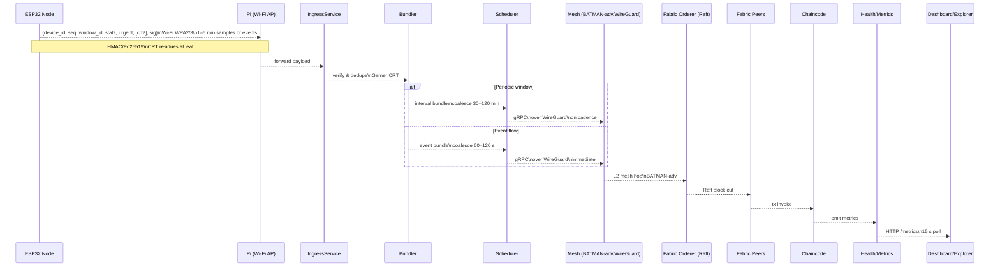

# Figure — Full Communication Scheme (ESP32 ↔ Pi ↔ Mesh ↔ Fabric ↔ Observability)

Related: [Five-Tier System Architecture](figure1_three_tier_system_architecture.md)

**What is transmitted**

| Hop | Protocol/Layer | Message/Fields | Size target | Timing | Reliability (retry/SOF) |
| --- | -------------- | -------------- | ----------- | ------ | ----------------------- |
| ESP32 → Pi | Wi-Fi (WPA2/3) | `{device_id, seq, window_id, stats, urgent, [crt?], sig}` | <100 B | 1–5 min or event | ESP32 retry, HMAC |
| Pi → Ingress | loopback | same payload | <100 B | immediate | n/a |
| Ingress → Bundler | in-memory | normalized reading | ~150 B | immediate | n/a |
| Bundler → Scheduler | in-memory | interval/event bundle metadata | ~1 KB | 30–120 min periodic; 60–120 s event | n/a |
| Scheduler → Mesh | gRPC over WireGuard | bundle `{bundle_id,…}` | 50–100 KB | cadence or immediate | SOF retry |
| Mesh → Orderer | BATMAN-adv L2 | Fabric envelope | ~100 KB | cadence or immediate | SOF retry |
| Orderer → Peers | Raft/gRPC | block `{prev_hash, merkle_root, ts}` | <1 MB | immediate | Fabric retry |
| Peers → Chaincode | gRPC | tx proposal | ~1 KB | immediate | Fabric retry |
| Chaincode → Metrics | internal | counters/gauges | n/a | on commit | n/a |
| Metrics → Dashboard | HTTP | `/metrics` scrape | text | 15 s poll | HTTP retry |

