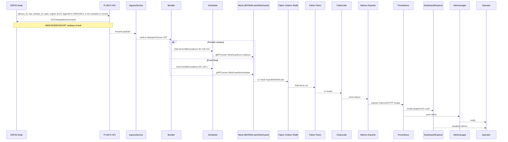

# Figure — Full Communication Scheme (ESP32 ↔ Pi ↔ Mesh ↔ Fabric ↔ Observability)

Related: [Five-Tier System Architecture](figure1_three_tier_system_architecture.md)


## End-to-end sequence (periodic and event flows)

```mermaid
sequenceDiagram
    participant ESP32 as ESP32 Node
    participant PI as Pi (Wi-Fi AP)
    participant INGRESS as IngressService
    participant BUNDLER as Bundler
    participant SCHED as Scheduler
    participant MESH as Mesh (BATMAN-adv/WireGuard)
    participant ORDERER as Fabric Orderer (Raft)
    participant PEERS as Fabric Peers
    participant CC as Chaincode
    participant METRICS as Metrics Exporter
    participant PROM as Prometheus
    participant DASH as Dashboard/Explorer
    participant ALERTS as Alertmanager
    participant OP as Operator

    ESP32->>ESP32: Sample every 1-5 min; detect thresholds; keep monotonic sequence
    ESP32-->>PI: Leaf payload (device_id, seq, window_id, stats, last_ts, sensor_set, urgent, crt optional, sig)
    PI-->>ESP32: ACK / keepalive / command
    PI->>PI: HMAC or Ed25519 signature; optional CRT residues at leaf

    PI-->>INGRESS: forward payload (local)
    INGRESS->>INGRESS: verify signature
    INGRESS->>INGRESS: dedupe by device_id and seq
    INGRESS->>INGRESS: reconstruct CRT via Garner if present
    INGRESS-->>BUNDLER: NormalizedReading

    alt Periodic window
        BUNDLER-->>SCHED: interval bundle
        BUNDLER->>BUNDLER: window 30-120 min
        SCHED-->>MESH: submit on cadence
        MESH->>MESH: grpc over TLS via WireGuard
    else Event flow
        BUNDLER-->>SCHED: event bundle
        BUNDLER->>BUNDLER: coalesce 60-120 s; rate limit
        SCHED-->>MESH: submit immediately
        MESH->>MESH: grpc over TLS
    end

    MESH->>MESH: L2 mesh on bat0; 2-5 ms per hop; WokFi links
    MESH-->>ORDERER: Fabric envelope to orderer cluster
    ORDERER-->>PEERS: ordered block broadcast (Raft)
    PEERS-->>CC: endorse / validate / commit
    CC-->>PEERS: chaincode events

    PEERS-->>METRICS: increment counters and gauges on commit
    METRICS-->>PROM: expose metrics endpoint (HTTP pull)
    PROM-->>DASH: render graphs and tables
    PROM-->>ALERTS: fire alerts on rules
    ALERTS-->>OP: notify (email or webhook)
    DASH-->>OP: visualize and drill down

    SCHED->>SCHED: after submit, wait for commit; read-back verify one key; log submit_to_commit latency

```
## End-to-end sequence (periodic and event flows)

**What is transmitted**

| Hop | Protocol/Layer | Message/Fields | Size target | Timing | Reliability (retry/SOF) |
| --- | -------------- | -------------- | ----------- | ------ | ----------------------- |
| ESP32 → Pi | Wi-Fi (WPA2/3) | `{device_id, seq, window_id, stats, urgent, [crt?], sig}` | <100 B | 1–5 min or event | ESP32 retry, HMAC |
| Pi → ESP32 | Wi-Fi | ACK/command | <50 B | immediate | WPA retry |
| Pi → Ingress | loopback | same payload | <100 B | immediate | n/a |
| Ingress → Bundler | in-memory | normalized reading | ~150 B | immediate | n/a |
| Bundler → Scheduler | in-memory | interval/event bundle metadata | ~1 KB | 30–120 min periodic;<br/>60–120 s event | n/a |
| Scheduler → Mesh | gRPC over WireGuard | bundle `{bundle_id,…}` | 50–100 KB | cadence or immediate | SOF retry |
| Mesh → Orderer | BATMAN-adv L2 | Fabric envelope | ~100 KB | cadence or immediate | SOF retry |
| Orderer → Peers | Raft/gRPC | block `{prev_hash, merkle_root, ts}` | <1 MB | immediate | Fabric retry |
| Peers → Chaincode | gRPC | tx proposal | ~1 KB | immediate | Fabric retry |
| Chaincode → Metrics | internal | counters/gauges | n/a | on commit | n/a |
| Metrics → Prometheus | HTTP | `/metrics` scrape | text | 15 s poll | HTTP retry |
| Prometheus → Dashboard | HTTP/WebSocket | rendered metrics | text/JSON | on demand | HTTP retry |
| Prometheus → Alertmanager | HTTP | alert payloads | small | on rule trigger | HTTP retry |
| Alertmanager → Operator | Email/Webhook | notification | text | on alert | transport retry |
| Dashboard → Operator | HTTP/WebSocket | visualization updates | text/JSON | on demand | HTTP retry |

