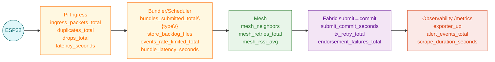

# Figure — Evaluation: Energy & Communications Metrics (ESP32 + Pi + Mesh + Fabric)

Related: [Five-Tier System Architecture](figure1_three_tier_system_architecture.md)

## Part A — Metrics Topology



## Part B — Latency Pipeline

`Latency_total = L_read + L_wifi + L_ingress + L_bundle_wait + L_sched + L_mesh + L_submit→commit`

```mermaid
graph LR
    L_read[L_read<br/>sensor sampling]
    L_wifi[L_wifi<br/>10-20 ms<br/>transmit over Wi-Fi]
    L_ingress[L_ingress<br/>packet processing]
    L_bundle[L_bundle_wait<br/>30-120 min periodic<br/>approx 0 events, coalesce 60-120 s]
    L_sched[L_scheduler<br/>scheduling latency]
    L_mesh[L_mesh<br/>mesh hop latency]
    L_sc[L_submit->commit<br/>1-2 s (2 Pis)<br/>3-5 s (20 Pis)<br/>10-15 s (100 Pis)]
    L_total[Latency_total]

    L_read --> L_wifi --> L_ingress --> L_bundle --> L_sched --> L_mesh --> L_sc --> L_total
```

## Part C — Energy Budgets

### ESP32

| Component | Current (mA) | Time/day | Notes |
| --- | --- | --- | --- |
| Sensors sampling | 5 | duty cycle based | per sensor draw |
| Wi-Fi TX uplink (periodic) | 200 | uplink_period_sec | window summary |
| Wi-Fi TX uplink (event) | 200 | bursts | immediate events |
| Deep sleep | 0.01 | remaining | baseline |

Assume 3.3 V supply. Daily energy `E_day ≈ Σ(I_i × t_i) × V`.

### Raspberry Pi

| State | Power (W) | Time/day | Notes |
| --- | --- | --- | --- |
| Idle baseline | 2.5 | always | OS + services |
| Mesh/Wi-Fi6 active | 1.0 | network traffic | BATMAN-adv/WireGuard overhead |
| Block processing | 1.5 | cadence dependent | bundling & submit | 
| Logging/monitoring | 0.5 | optional | debug cost |

### Knobs to lower cost

- `sample_period_sec`
- `uplink_period_sec`
- event thresholds / hysteresis
- CRT to reduce airtime

See [metrics documentation](../docs/metrics.md) and [CRT overview](../docs/crt.md) for details.

