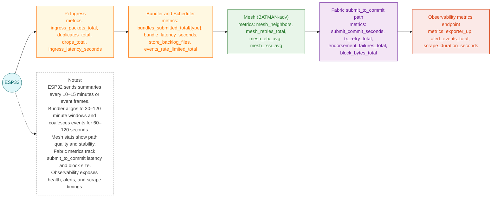
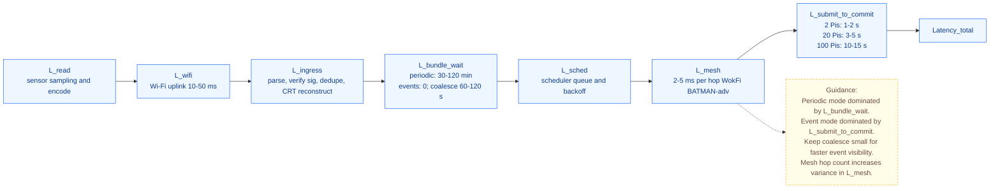
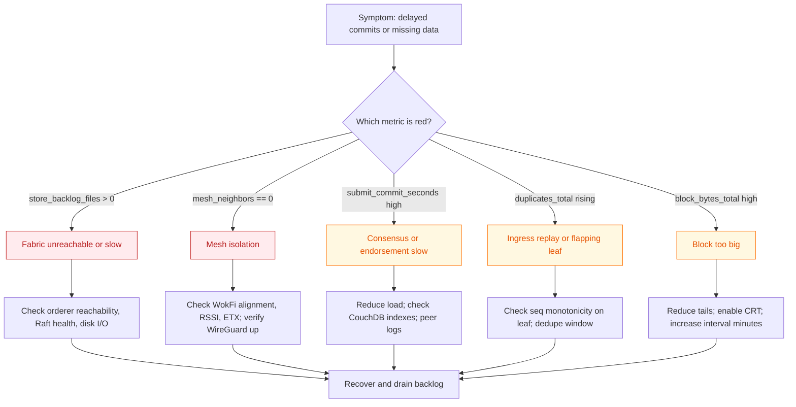

# Figure — Evaluation: Energy & Communications Metrics (ESP32 + Pi + Mesh + Fabric)

Related: [Five-Tier System Architecture](figure1_three_tier_system_architecture.md)

I built this system to measure performance and energy use. This document describes the metrics path, latency at each step, and power consumption. Diagrams use plain ASCII for reliable rendering on GitHub.

---

## Part A — Metrics Topology

The flow starts at the ESP32, passes through the Pi gateway and mesh, and ends at the blockchain and monitoring stack. Each box lists Prometheus metrics gathered at that stage.

---

## Part B — Latency Pipeline

Total latency is the sum of these components:
`Latency_total = L_read + L_wifi + L_ingress + L_bundle_wait + L_sched + L_mesh + L_submit_to_commit`
Each term reflects a measurable stage in the pipeline: `L_read` covers sensor sampling, `L_wifi` is the wireless hop to the gateway, `L_ingress` accounts for parsing and deduplication, `L_bundle_wait` is the scheduler's coalescing delay, `L_sched` is time spent queued, `L_mesh` measures multi-hop forwarding, and `L_submit_to_commit` is the blockchain confirmation path.

These delays form the time a reading needs to appear on-chain. Periodic data is dominated by bundling delay, while event data is limited mostly by blockchain commit time.

---

## Part C — Energy Budgets

The values below derive from my hardware. Current draws come from Espressif datasheets and inline meter readings; adjust currents and duty cycles for specific components before recalculating totals.

### C1. ESP32 leaf node (Wi-Fi uplink)

**Electrical parameters:**

* Supply: 3.3 V
* Deep sleep current: 0.01 mA (10 µA)
* Light sleep current: 2–10 mA (used only when enabled between samples)
* Active CPU (read/encode): 40–80 mA for 50–150 ms per sensor set
* Wi-Fi TX burst: 160–240 mA for 80–200 ms per uplink (depends on AP RSSI and data size)
* Per-sensor current during sampling:

  * DHT22: 1–1.5 mA for 2 ms conversion plus MCU active time
  * Light (resistive divider to ADC): 0.1–1 mA while read
  * Capacitive soil moisture board: 5–30 mA while powered; gate it via MOSFET to read only
  * pH front-end board: 5–10 mA during read
  * Water level (float): 0 mA; ultrasonic: 2–10 mA during ping

**Configuration parameters:**

* `sample_period_sec` range 60–300 s
* `uplink_period_sec` range 600–1800 s (10–30 min)
* Event coalesce window: 60–120 s
* CRT shrinks bytes sent during uplink

**Daily energy formula per node:**
`E_day_Wh = (Σ_i (I_i_mA * t_i_s) * V / 1000) / 3600`
where `i` covers sleep, sampling, and TX states. The expression comes from `E = V × I × t`: divide by `1000` to convert milliamps to amps and by `3600` to change seconds to hours, yielding watt-hours. Current values are sourced from Espressif datasheets and bench measurements.

**Example scenario:**

* Sample every 120 s (720 samples/day), total active per sample 120 ms at 60 mA effective (includes sensor currents via gating):
  * Sampling energy per day: `I=60 mA, t = 720 * 0.12 s = 86.4 s`
* Uplink every 900 s (15 min) with 120 B payload; Wi-Fi TX 200 ms at 200 mA + CPU 50 ms at 80 mA:
  * 96 uplinks/day
  * TX energy per day: `I=200 mA, t = 96 * 0.2 s = 19.2 s`
  * CPU energy per day: `I=80 mA, t = 96 * 0.05 s = 4.8 s`
* Deep sleep otherwise (no light sleep), `t = 86400 s - (86.4 + 19.2 + 4.8) s = 86289.6 s`
  * Sleep energy per day: `I=0.01 mA, t = 86289.6 s`

Using these numbers:
`E_day_Wh = ((60 mA * 86.4 s) + (200 mA * 19.2 s) + (80 mA * 4.8 s) + (0.01 mA * 86289.6 s)) * 3.3 V / 1000 / 3600 ≈ 0.0094 Wh`
This is roughly 9.4 mWh per day.

Energy per uplink in this scenario is `E_uplink_mWh = 9.4 mWh / 96 ≈ 0.098 mWh`. This lets you compare firmware revisions by energy cost per delivered summary instead of only daily totals.

### C2. Raspberry Pi gateway

The Pi powers the mesh, bundling, and Fabric peers. Measure wall power with a USB inline meter or AC plug analyzer and compute daily energy via `E_pi_day_Wh = Σ_j (P_j_W * t_j_s) / 3600`.

**Typical power states:**

* Idle baseline: 2.5 W (Pi 4 with OS services)
* Mesh/Wi-Fi6 active: +1.0 W while forwarding packets
* Block processing bursts: +1.5 W during bundling and `submit_to_commit`
* Logging/monitoring: +0.5 W if verbose debug enabled

**Example day:** mesh active for 6 h, 96 commits at 5 s each, logging 1 h:

* `P_idle = 2.5 W, t_idle = 86400 s`
* `P_mesh = 1.0 W, t_mesh = 21600 s`
* `P_block = 1.5 W, t_block = 96 * 5 s = 480 s`
* `P_log = 0.5 W, t_log = 3600 s`

`E_pi_day_Wh ≈ (2.5*86400 + 1.0*21600 + 1.5*480 + 0.5*3600) / 3600 ≈ 70 Wh`

Adjust times for your deployment; tracking this helps budget battery or solar capacity.

---

## Part D — Communications metrics evaluation

To judge network health and airtime efficiency, derive these ratios from the Prometheus counters:

* **Ingress drop rate:** `drop_rate = drops_total / ingress_packets_total`
* **Duplicate rate:** `dup_rate = duplicates_total / ingress_packets_total`
* **Mesh retry rate:** `retry_rate = mesh_retries_total / bundles_submitted_total`
* **Average mesh throughput:** `T_mesh_day / 86400` bytes per second using `T_mesh_day` from Part J
* **End-to-end success:** `1 - drop_rate - dup_rate`

Evaluate 24 h windows; alert if drop or duplicate rates exceed 1% or if mesh retries spike after a link change. Alert rules include a duration of 5 minutes to avoid flapping.

---

## Part I — Measurement and validation plan

1. **Leaf bench test**

   * Fix `sample_period_sec=60`, `uplink_period_sec=900`, event thresholds safe.
   * Record payload bytes, RSSI, TX duration (firmware log), ESP32 current (inline meter).
   * Output daily Wh estimate using the table formula.

2. **Gateway ingest test**

   * Replay 1k synthetic payloads at 1–5 Hz.
   * Verify dedupe rate 0, `ingress_latency_seconds` p50 < 10 ms, p99 < 50 ms.

3. **Event path test**

   * Trigger 3 distinct events within 90 s.
   * Expect exactly 1 EventBundle after coalesce; `submit_to_commit` < 6 s.

4. **Periodic path soak**

   * Run for 6 hours at 30 min cadence.
   * Expect 12 IntervalBundles, 12 blocks, no backlog, stable `block_bytes_total`.

5. **Mesh impairment**

   * Drop one WokFi link (attenuator or antenna rotate) for 5 min.
   * Expect reroute within 10–30 s, ETX spike, `submit_to_commit` increases but stays below threshold.

6. **Power profiling**

   * Measure Pi wall power with and without mesh + Fabric to isolate network and consensus cost.
   * Log average and peak watts; convert to daily Wh using `P * t / 3600`.
   * For ESP32 leaves, cross-check meter readings against `E_uplink_mWh` from Part C.

7. **Communication reliability test**

   * Sustain 1 Hz traffic for 10 min while varying RSSI with an attenuator.
   * Observe `drops_total`, `duplicates_total`, and `mesh_retries_total`.
   * Expect drop and duplicate rates below 1% and retry rate under 5% for healthy links.

---

## Part J — Capacity planning (formulas)

Let:

* `N_pi` = number of gateways (peers)
* `N_leaf_per_pi` = leaves per gateway
* `R` = readings per leaf per day (window summaries; typically 96 at 15 min)
* `S_payload` = bytes per leaf summary (100 B)
* `S_bundle` = `N_leaf_per_pi * S_payload + overhead` (50–100 kB)
* `B_cadence` = bundles per day per gateway (24h / window_minutes)

**Daily traffic per gateway over mesh:**
`T_mesh_day = B_cadence * S_bundle`
This estimates the bytes a gateway forwards across the mesh each day.

**Ledger growth per day (summaries only):**
`G_ledger_day = N_pi * B_cadence * (avg block bytes)`
(keep avg block bytes well below `PreferredMaxBytes`; target 100–200 kB). This gives a daily ledger size increase based on block payloads.

**Peer CPU headroom:** keep endorser rate far below saturation; summaries keep utilization low.

---

## Part K — Data retention and block sizing guidance

* Keep only summaries on-chain; store raw samples off-chain (`STORE_DIR`) with `MerkleRoot` anchor.
* Target avg block size 100–200 kB to keep commit times predictable on Pis.
* Retain off-chain raw for 30–90 days; prune oldest when disk watermark exceeds 70%.
* If `block_bytes_total` trends upward:
  * Reduce raw tails in events, enable CRT compaction, raise window minutes, or shard channels per field station.

---

## Part L — Troubleshooting workflow

---

## Part M — Glossary

* **CRT**: Chinese Remainder Theorem, used to compact large integers into residues; recombined via Garner on the Pi.
* **Coalesce window**: short time (60–120 s) during which multiple event payloads merge into one bundle.
* **ETX**: Expected Transmission Count; mesh quality indicator (lower is better).
* **STORE_DIR**: on-disk queue for store-and-forward when Fabric or mesh is down.
* **submit_to_commit**: time between bundle submission and commit event observed by a peer.

---

## Appendix — Quick sanity checklist

* [ ] ESP32 payloads under 100 B; signature verified; sequence numbers monotonic.
* [ ] Interval cadence set to 30–120 min; event coalesce 60–120 s.
* [ ] Mesh neighbors ≥ 1; ETX < 2.0; WireGuard established.
* [ ] `submit_to_commit` p95 within defined targets.
* [ ] Block bytes near 100–200 kB; `PreferredMaxBytes` about 1 MB.
* [ ] Prometheus scrapes `/metrics`; alert rules loaded; dashboards show event vs periodic paths.

---

