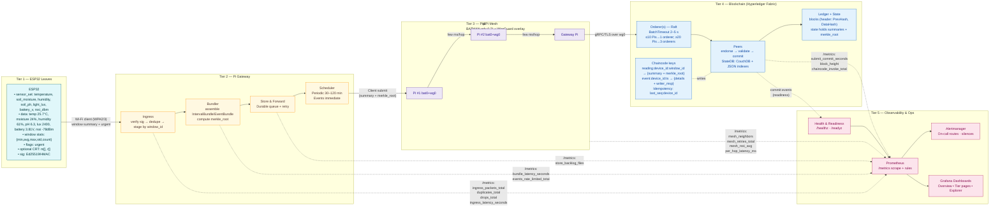

```mermaid
flowchart LR
  %% ========== FIVE-TIER, END-TO-END ==========
  %% LAYOUT
  %% Left→Right: Tier 1 (ESP32) → Tier 2 (Pi GW) → Tier 3 (Mesh) → Tier 4 (Fabric) → Tier 5 (Obs)

  %% -------- TIER 1: ESP32 LEAVES --------
  subgraph T1["Tier 1 — ESP32 Leaves"]
    direction TB
    L1["ESP32\n• sensor_set: temperature, soil_moisture, humidity, soil_ph, light_lux, battery_v, rssi_dbm\n• data: temp 25.7°C, moisture 24%, humidity 61%, pH 6.3, lux 2400, battery 3.81V, rssi -78dBm\n• window stats: {min,avg,max,std,count}\n• flags: urgent\n• optional CRT: m[], r[]\n• sig: Ed25519/HMAC"]:::t1
  end

  %% -------- TIER 2: PI GATEWAY (INGRESS → BUNDLER) --------
  subgraph T2["Tier 2 — Pi Gateway"]
    direction TB
    IN["Ingress\nverify sig → dedupe → stage by window_id"]:::t2
    BN["Bundler\nassemble IntervalBundle/EventBundle\ncompute merkle_root"]:::t2
    SF["Store & Forward\nDurable queue + retry"]:::t2
    SCH["Scheduler\nPeriodic 30–120 min\nEvents immediate"]:::t2
    IN --> BN --> SF --> SCH
  end

  %% -------- TIER 3: PI⇄PI MESH --------
  subgraph T3["Tier 3 — Pi⇄Pi Mesh\nBATMAN-adv (L2) + WireGuard overlay"]
    direction TB
    P1["Pi #1 bat0+wg0"]:::t3 -->|"few ms/hop"| P2["Pi #2 bat0+wg0"]:::t3 -->|"few ms/hop"| GW["Gateway Pi"]:::t3
  end

  %% -------- TIER 4: HYPERLEDGER FABRIC --------
  subgraph T4["Tier 4 — Blockchain (Hyperledger Fabric)"]
    direction TB
    ORD["Orderer(s) — Raft\nBatchTimeout 2–5 s\n≤10 Pis→1 orderer; ≥20 Pis→3 orderers"]:::t4
    PEER["Peers\nendorse → validate → commit\nStateDB: CouchDB + JSON indexes"]:::t4
    CC["Chaincode keys\nreading:device_id:window_id → {summary + merkle_root}\nevent:device_id:ts → {details + writer_msp}\nIdempotency: last_seq:device_id"]:::t4
    LEDGER["Ledger + State\nblocks (header: PrevHash, DataHash)\nstate holds summaries + merkle_root"]:::t4
    ORD --> PEER --> LEDGER
    CC -. writes .- PEER
  end

  %% -------- TIER 5: OBSERVABILITY --------
  subgraph T5["Tier 5 — Observability & Ops"]
    direction TB
    HZ["Health & Readiness\n/healthz · /readyz"]:::t5
    PR["Prometheus\n/metrics scrape + rules"]:::t5
    GF["Grafana Dashboards\nOverview • Tier pages • Explorer"]:::t5
    AM["Alertmanager\nOn-call routes · silences"]:::t5
    PR --> AM
    PR --> GF
    HZ --> PR
  end

  %% -------- DATA FLOW (LEFT→RIGHT) --------
  L1 -->|"Wi-Fi client (WPA2/3)\nwindow summary + urgent"| IN
  SCH -->|"Client submit\n(summary + merkle_root)"| P1
  GW -->|"gRPC/TLS over wg0"| ORD

  %% -------- OBSERVABILITY FEEDS --------
  IN -. "/metrics:\ningress_packets_total\nduplicates_total\ndrops_total\ningress_latency_seconds" .-> PR
  BN -. "/metrics:\nbundle_latency_seconds\nevents_rate_limited_total" .-> PR
  SF -. "/metrics:\nstore_backlog_files" .-> PR
  T3 -. "/metrics:\nmesh_neighbors\nmesh_retries_total\nmesh_rssi_avg\nper_hop_latency_ms" .-> PR
  PEER -. "/metrics:\nsubmit_commit_seconds\nblock_height\nchaincode_invoke_total" .-> PR
  PEER -. "commit events\n(readiness)" .-> HZ

  %% -------- STYLES --------
  classDef t1 fill:#e0f7fa,stroke:#006064,color:#00363a;
  classDef t2 fill:#fff8e1,stroke:#ff8f00,color:#4e342e;
  classDef t3 fill:#ede7f6,stroke:#5e35b1,color:#311b92;
  classDef t4 fill:#e3f2fd,stroke:#1565c0,color:#0d47a1;
  classDef t5 fill:#fce4ec,stroke:#ad1457,color:#880e4f;
```
