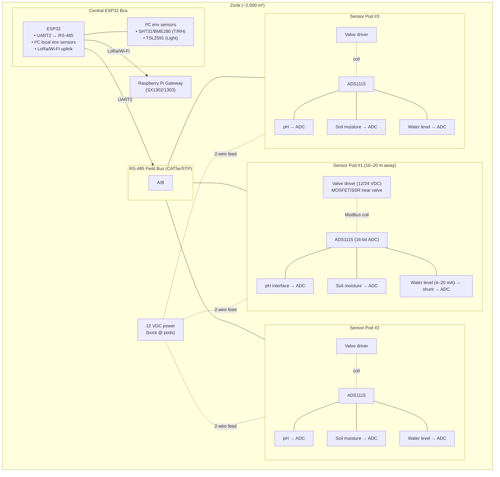
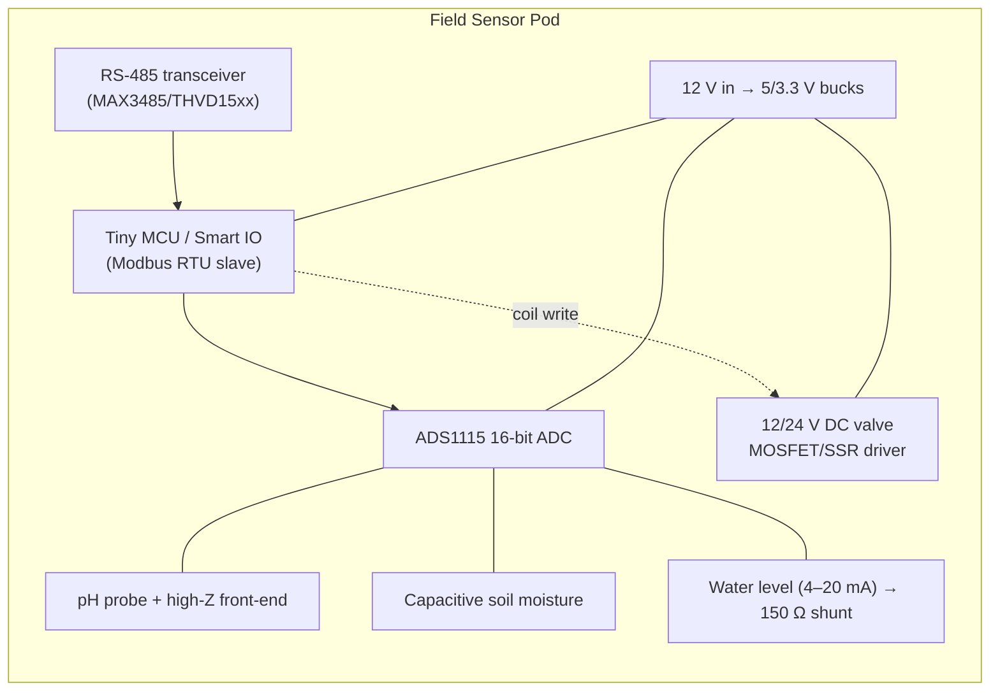

```mermaid
flowchart LR
  %% ===== Node for ~2,500 m² zone (Option A: Central ESP32 + RS-485 pods) =====
  subgraph ZONE["Zone (~2,500 m²)"]
    direction LR

    subgraph ESP["Central ESP32 Box"]
      direction TB
      E32["ESP32\n• UART2 ↔ RS-485\n• I²C local env sensors\n• LoRa/Wi-Fi uplink"]
      I2C["I²C env sensors\n• SHT31/BME280 (T/RH)\n• TSL2591 (Light)"]
      E32 --- I2C
    end

    subgraph BUS["RS-485 Field Bus (CAT5e/STP)"]
      direction LR
      A["A/B"]
    end

    subgraph POD1["Sensor Pod #1 (10–20 m away)"]
      direction TB
      ADC1["ADS1115 (16-bit ADC)"]
      PH1["pH interface → ADC"]
      SM1["Soil moisture → ADC"]
      WL1["Water level (4–20 mA) → shunt → ADC"]
      ACT1["Valve driver (12/24 VDC)\nMOSFET/SSR near valve"]
      ADC1 --- PH1
      ADC1 --- SM1
      ADC1 --- WL1
      ACT1 -. Modbus coil .- ADC1
    end

    subgraph POD2["Sensor Pod #2"]
      direction TB
      ADC2["ADS1115"]
      PH2["pH → ADC"]
      SM2["Soil moisture → ADC"]
      WL2["Water level → ADC"]
      ACT2["Valve driver"]
      ADC2 --- PH2
      ADC2 --- SM2
      ADC2 --- WL2
      ACT2 -. coil .- ADC2
    end

    subgraph POD3["Sensor Pod #3"]
      direction TB
      ADC3["ADS1115"]
      PH3["pH → ADC"]
      SM3["Soil moisture → ADC"]
      WL3["Water level → ADC"]
      ACT3["Valve driver"]
      ADC3 --- PH3
      ADC3 --- SM3
      ADC3 --- WL3
      ACT3 -. coil .- ADC3
    end

    PWR["12 VDC power\n(buck @ pods)"]

    %% Wiring
    E32 -->|UART2| BUS
    BUS --- POD1
    BUS --- POD2
    BUS --- POD3

    PWR -. 2-wire feed .- POD1
    PWR -. 2-wire feed .- POD2
    PWR -. 2-wire feed .- POD3

    %% Uplink
    GW["Raspberry Pi Gateway\n(SX1302/1303)"]
    E32 -->|"LoRa/Wi-Fi"| GW
  end

```

```mermaid
flowchart TB
  %% ===== Sensor Pod internals =====
  subgraph POD["Field Sensor Pod"]
    direction TB
    RS485["RS-485 transceiver\n(MAX3485/THVD15xx)"]
    MCU["Tiny MCU / Smart IO\n(Modbus RTU slave)"]
    ADC["ADS1115 16-bit ADC"]
    PH["pH probe + high-Z front-end"]
    SM["Capacitive soil moisture"]
    WL["Water level (4–20 mA) → 150 Ω shunt"]
    VALVE["12/24 V DC valve\nMOSFET/SSR driver"]
    PWR["12 V in → 5/3.3 V bucks"]

    RS485 --> MCU --> ADC
    ADC --- PH
    ADC --- SM
    ADC --- WL
    MCU -. "coil write" .-> VALVE
    PWR --- MCU
    PWR --- ADC
    PWR --- VALVE
  end

```
